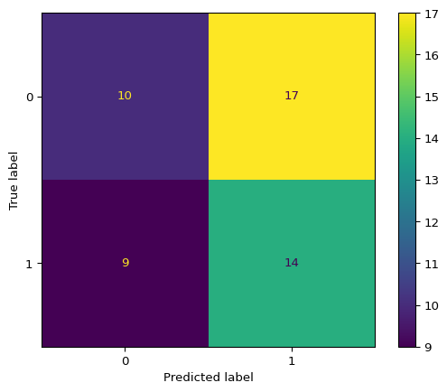
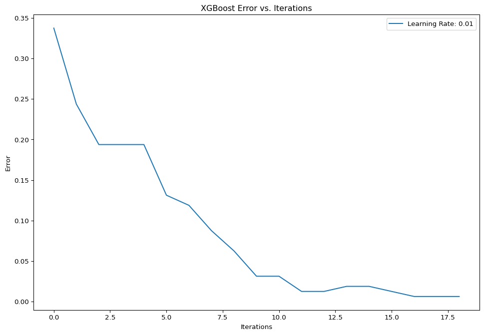
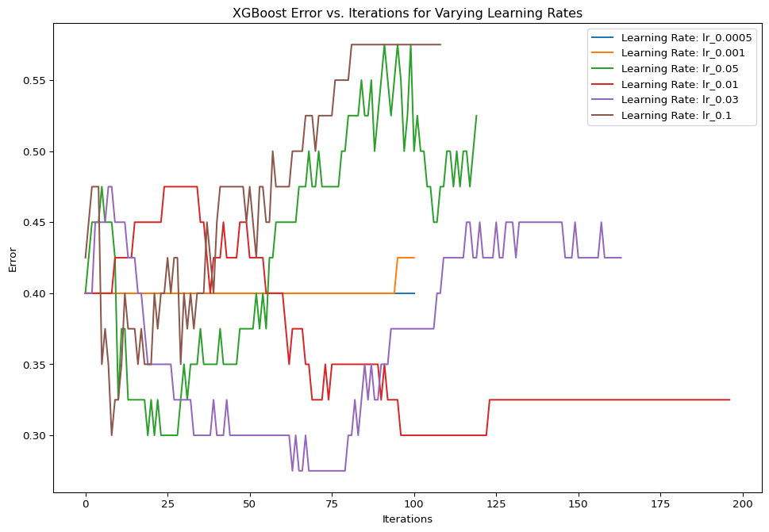

# Scouting Report Predictability


# Scouting Report Predictability

# \## How the Words of One NFL Insider Relate to a Player’s Chance to Go in the First

## Introduction

Professional sports “insiders” are paid a lot of money for their
insights and analysis on the game they claim to know. But how much of
what they say actually holds up in practice? Daniel Jeremiah is a former
NFL scot and current NFL Network analyst who posts his ideas on the top
50 prospects in the NFL draft every year. This project will analyze the
relationship between his scouting reports and the actual draft results
to see how well his words hold up.
<p align="center">


</p>

## Primary Question

The main question this project will answer is this: Can a single
person’s work accurately predict the likelihood of a player going in the
first round of the NFL draft? Daniel Jeremiah is the subject of this
project due to his status as an NFL Network analyst and the availability
of his past scouting reports.

## Scraping and Cleaning

In order to perform analysis on Jeremiah’s statements, they first need
to be scraped from the NFL website. For this project his Top 50
prospects from 2020-2025 were scraped and cleaned, then saved into a csv
file.

``` python
from bs4 import BeautifulSoup
import requests
import pandas as pd
import re

# Daniel Jeremiah Top 50 2020
url = 'https://www.nfl.com/news/daniel-jeremiah-s-top-50-2020-nfl-draft-prospect-rankings-2-0-0ap3000001102767'
# Scrape and process
response = requests.get(url)
soup_20 = BeautifulSoup(response.text, 'html.parser')
top_50_2020 = soup_20.select('.nfl-c-article__container')
article_range = range(0, len(top_50_2020))
top_50_2020 = [top_50_2020[x].text for x in article_range]
# Convert to dataframe
df_2020 = pd.DataFrame(columns = ['Name', 'Position', 'School', 'Report'])
# Pull data into dataframe
for i in range(2, 52):
    name = re.findall(r'\d+\)\s([A-Za-z\s\.\',\-]+),', top_50_2020[i])[0]
    position = re.findall(r'(?<=, ).*', top_50_2020[i])[0]
    school = re.findall(r'(?<=: ).* (?=[|])', top_50_2020[i])[0]
    report = max(re.findall(r'(?<=[\n\n]).*', top_50_2020[i]), key=len)
    df_2020.loc[len(df_2020)] = {'Name': name, 'Position': position, 'School': school, 'Report': report}

# Scrape Daniel Jeremiah Top 50 2021
url = 'https://www.nfl.com/news/daniel-jeremiah-s-top-50-2021-nfl-draft-prospect-rankings-3-0'
# Scrape and process
soup_21 = BeautifulSoup(requests.get(url).text, 'html.parser')
top_50_2021_info = soup_21.select('.nfl-o-ranked-item__content')
top_50_2021_report = soup_21.select('.nfl-c-body-part--text')
article_range = range(0, len(top_50_2021))
report_range = range(0, len(top_50_2021_report))
top_50_2021_info = [top_50_2021[x].text for x in article_range]
top_50_2021_report = [top_50_2021_report[x].text for x in report_range]
# Convert to dataframe
df_2021 = pd.DataFrame(columns = ['Name', 'Position', 'School', 'Report'])
# Pull info into dataframe
for i in range(0, 50):
    name = re.findall(r'([A-Za-z\s\.\',\-]+)\n\n', top_50_2021_info[i])[0]
    position = re.findall(r'·\s*([^·]+)\s* ·', top_50_2021_info[i])[0]
    school = re.findall(r'\n\s*([^\n\r·]+)\s*·', top_50_2021_info[i])[0]
    df_2021.loc[len(df_2021)] = {'Name': name, 'Position': position, 'School': school, 'Report': top_50_2021_report[i + 1]}
# Clean dataframe
df_2021['Report'] = df_2021['Report'].str.strip()
df_2021['Name'] = df_2021['Name'].str.strip()

# Scrape Daniel Jeremiah Top 50 2022
url = 'https://www.nfl.com/news/daniel-jeremiah-s-top-50-2022-nfl-draft-prospect-rankings-3-0'
# Scrape and process
soup_22 = BeautifulSoup(requests.get(url).text, 'html.parser')
top_50_2022_info = soup_22.select('.nfl-o-ranked-item__content')
top_50_2022_report = soup_22.select('.nfl-c-body-part--text')
article_range = range(0, len(top_50_2022_info))
report_range = range(0, len(top_50_2022_report))
top_50_2022_info = [top_50_2022_info[x].text for x in article_range]
top_50_2022_report = [top_50_2022_report[x].text for x in report_range]
# Convert to dataframe
df_2022 = pd.DataFrame(columns = ['Name', 'Position', 'School', 'Report'])
# Pull info into dataframe
for i in range(0, 50):
    name = re.findall(r'([A-Za-z\s\.\',\-]+)\n\n', top_50_2022_info[i])[0]
    position = re.findall(r'·\s*([^·]+)\s* ·', top_50_2022_info[i])[0]
    school = re.findall(r'\n\s*([^\n\r·]+)\s*·', top_50_2022_info[i])[0]
    df_2022.loc[len(df_2022)] = {'Name': name, 'Position': position, 'School': school, 'Report': top_50_2022_report[i + 1]}
# Clean dataframe
df_2022['Report'] = df_2022['Report'].str.strip()
df_2022['Name'] = df_2022['Name'].str.strip()

# Scrape Daniel Jeremiah Top 50 2023
url = 'https://www.nfl.com/news/daniel-jeremiah-s-top-50-2023-nfl-draft-prospect-rankings-4-0'
# Scrape and process
soup_23 = BeautifulSoup(requests.get(url).text, 'html.parser')
top_50_2023_info = soup_23.select('.nfl-o-ranked-item__content')
top_50_2023_report = soup_23.select('.nfl-c-body-part--text')
article_range = range(0, len(top_50_2023_info))
report_range = range(0, len(top_50_2023_report))
top_50_2023_info = [top_50_2023_info[x].text for x in article_range]
top_50_2023_report = [top_50_2023_report[x].text for x in report_range]
# Convert to dataframe
df_2023 = pd.DataFrame(columns = ['Name', 'Position', 'School', 'Report'])
# Pull info into dataframe
for i in range(0, 50):
    name = re.findall(r'([A-Za-z\s\.\',\-]+)\n\n', top_50_2023_info[i])[0]
    position = re.findall(r'·\s*([^·]+)\s* ·', top_50_2023_info[i])[0]
    school = re.findall(r'\n\s*([^\n\r·]+)\s*·', top_50_2023_info[i])[0]
    df_2023.loc[len(df_2023)] = {'Name': name, 'Position': position, 'School': school, 'Report': top_50_2023_report[i + 1]}
# Clean dataframe
df_2023['Report'] = df_2023['Report'].str.strip()
df_2023['Name'] = df_2023['Name'].str.strip()

# Scrape Daniel Jeremiah Top 150 2024
url = 'https://www.nfl.com/news/daniel-jeremiah-s-top-150-prospects-in-the-2024-nfl-draft-class'
# Scrape and process
soup_24 = BeautifulSoup(requests.get(url).text, 'html.parser')
top_150_2024_info = soup_24.select('.nfl-o-ranked-item__content')
top_150_2024_report = soup_24.select('.nfl-c-body-part--text')
article_range = range(0, len(top_150_2024_info))
report_range = range(0, len(top_150_2024_report))
top_150_2024_info = [top_150_2024_info[x].text for x in article_range]
top_150_2024_report = [top_150_2024_report[x].text for x in report_range]
# Convert to dataframe
df_2024 = pd.DataFrame(columns = ['Name', 'Position', 'School', 'Report'])
# Pull info into dataframe
for i in range(0, 50):
    name = re.findall(r'([A-Za-z\s\.\',\-]+)\n\n', top_150_2024_info[i])[0]
    position = re.findall(r'·\s*([^·]+)\s* ·', top_150_2024_info[i])[0]
    school = re.findall(r'\n\s*([^\n\r·]+)\s*·', top_150_2024_info[i])[0]
    df_2024.loc[len(df_2024)] = {'Name': name, 'Position': position, 'School': school, 'Report': top_150_2024_report[i + 3]}
# Clean dataframe
df_2024['Report'] = df_2024['Report'].str.strip()
df_2024['Name'] = df_2024['Name'].str.strip()

# Scrape Daniel Jeremiah Top 50 2025
url = 'https://www.nfl.com/news/daniel-jeremiah-s-top-50-2025-nfl-draft-prospect-rankings-1-0'
# Scrape and process
soup_25 = BeautifulSoup(requests.get(url).text, 'html.parser')
top_50_2025_info = soup_25.select('.nfl-o-ranked-item__content')
top_50_2025_report = soup_25.select('.nfl-c-body-part--text')
article_range = range(0, len(top_50_2025_info))
report_range = range(0, len(top_50_2025_report))
top_50_2025_info = [top_50_2025_info[x].text for x in article_range]
top_50_2025_report = [top_50_2025_report[x].text for x in report_range]
# Convert to dataframe
df_2025 = pd.DataFrame(columns = ['Name', 'Position', 'School', 'Report'])
# Pull info into dataframe
for i in range(0, 50):
    name = re.findall(r'([A-Za-z\s\.\',\-]+)\n\n', top_50_2025_info[i])[0]
    position = re.findall(r'·\s*([^·]+)\s* ·', top_50_2025_info[i])[0]
    school = re.findall(r'\n\s*([^\n\r·]+)\s*·', top_50_2025_info[i])[0]
    df_2025.loc[len(df_2025)] = {'Name': name, 'Position': position, 'School': school, 'Report': top_50_2025_report[i + 3]}
# Clean dataframe
df_2025['Report'] = df_2025['Report'].str.strip()
df_2025['Name'] = df_2025['Name'].str.strip()

# Save dataframes
#df_2020.to_csv('data/scoutingreports/jeremiah_2020.csv', index=False)
#df_2021.to_csv('data/scoutingreports/jeremiah_2021.csv', index=False)
#df_2022.to_csv('data/scoutingreports/jeremiah_2022.csv', index=False)
#df_2023.to_csv('data/scoutingreports/jeremiah_2023.csv', index=False)
#df_2024.to_csv('data/scoutingreports/jeremiah_2024.csv', index=False)
#df_2025.to_csv('data/scoutingreports/jeremiah_2025.csv', index=False)
```

In order to properly perform text analysis on these reports, the text
needs to be properly cleaned and tokenized. The stopwords used to clean
the data were scraped from the SMART Stopwords.

``` python
# Link to SMART stopwords
url = 'http://www.ai.mit.edu/projects/jmlr/papers/volume5/lewis04a/a11-smart-stop-list/english.stop'

# Get the page and convert it to a BeautifulSoup object
response = requests.get(url)
soup = BeautifulSoup(response.content, 'html.parser')

# Convert soup to a list
stopwords = soup.get_text().split()

# Convert to dataframe and save to CSV
stopwords_df = pd.DataFrame(stopwords, columns=['stopword'])
#stopwords_df.to_csv('data/stopwords.csv', index=False)
```

## Methods

Now that the data has been scraped and the stopwords are ready, the next
step is to perform text analysis on the reports. The first step is to
clean the text and remove stopwords. The next step is to tokenize the
text and count the frequency of each word.

``` python
import nltk
from nltk.stem import WordNetLemmatizer
import pandas as pd
import xgboost as xgb
from sklearn.feature_extraction.text import TfidfVectorizer
from sklearn.model_selection import train_test_split, RandomizedSearchCV, GridSearchCV
from sklearn.metrics import accuracy_score, confusion_matrix, ConfusionMatrixDisplay
import plotly.express as px
import matplotlib.pyplot as plt
import dalex as dx
import shap
import numpy as np
import pandas as pd

# Read in data
first_rounders = pd.read_csv('G:/My Drive/Py Projects/nfl-draft-preview/data/2020_to_2024_first_rounders.csv')
report_20 = pd.read_csv('G:/My Drive/Py Projects/nfl-draft-preview/data/scoutingreports/jeremiah_2020.csv')
report_21 = pd.read_csv('G:/My Drive/Py Projects/nfl-draft-preview/data/scoutingreports/jeremiah_2021.csv')
report_22 = pd.read_csv('G:/My Drive/Py Projects/nfl-draft-preview/data/scoutingreports/jeremiah_2022.csv')
report_23 = pd.read_csv('G:/My Drive/Py Projects/nfl-draft-preview/data/scoutingreports/jeremiah_2023.csv')
report_24 = pd.read_csv('G:/My Drive/Py Projects/nfl-draft-preview/data/scoutingreports/jeremiah_2024.csv')
report_25 = pd.read_csv('G:/My Drive/Py Projects/nfl-draft-preview/data/scoutingreports/jeremiah_2025.csv')
stopwords = pd.read_csv('G:/My Drive/Py Projects/nfl-draft-preview/data/stopwords.csv')

# Combine reports
reports_past = pd.concat([report_20, report_21, report_22, report_23, report_24])

# Dummy first rounders
reports_past['first_rounder'] = reports_past['Name'].isin(first_rounders['Player']).astype(int)

# Lemmatize first
w_tokenizer = nltk.tokenize.WhitespaceTokenizer()
lemmatizer = nltk.stem.WordNetLemmatizer()
def lemmatize_text(text):
    return [lemmatizer.lemmatize(word) for word in w_tokenizer.tokenize(text)]
reports_past['report_lemmatized'] = reports_past['Report'].apply(lemmatize_text)

# Remove stopwords
reports_past['report_lemmatized'] = reports_past['report_lemmatized'].apply(lambda x: [item for item in x if item not in stopwords['stopword'].values])

# Define dataframe
xgb_df = reports_past[['report_lemmatized', 'first_rounder']].copy()
```

After this I convert the text into a format that can be used in a
machine learning model. The TfidfVectorizer will be used to convert the
text into a matrix of TF-IDF features.

``` python
# Convert text to TF-IDF features
vectorizer = TfidfVectorizer()
tfidf_matrix = vectorizer.fit_transform(xgb_df['report_lemmatized'].apply(lambda x: ' '.join(x)))

# Make sure output is interpretable
feature_names = vectorizer.get_feature_names_out()
df_tfidf = pd.DataFrame(tfidf_matrix.toarray(), columns=feature_names)
```

Once this is done, the data is ready to be set up for model training.
Once this is done we can train the model and see how well it performs
initially.

``` python
# INITIAL XGBoost classifier
xgb_clf = xgb.XGBClassifier(objective='binary:logistic', random_state=102701)

# Split data
X_train, X_test, y_train, y_test = train_test_split(df_tfidf, xgb_df['first_rounder'], test_size=0.2, random_state=102701)

# Fit to training data
xgb_clf.fit(X_train, y_train)

# Create basic predictions
y_pred = xgb_clf.predict(X_test)
initial_accuracy = accuracy_score(y_test, y_pred)
print(f'Initial accuracy: {initial_accuracy * 100:.2f}%')

# Check confusion matrix  to see where the model struggles
conf_matrix = confusion_matrix(y_test, y_pred)
cm_display = ConfusionMatrixDisplay(conf_matrix).plot()
plt.show()
```

    Initial accuracy: 48.00%



After this, the model can be tuned to find the best hyperparameters.

``` python
# Split validation set from training set
X_train, X_val, y_train, y_val = train_test_split(X_train, y_train, test_size=0.2, random_state=102701)

# Fit model to training data for tuning
eval_metrics = ['auc', 'error']
model_1 = xgb.XGBClassifier(learning_rate = 0.1, n_estimators = 500, 
                            random_state = 102701, early_stopping_rounds = 10,
                            eval_metric=eval_metrics, objective='binary:logistic')
eval_set =[(X_train, y_train), (X_val, y_val)]
model_1.fit(X_train, y_train, eval_set=eval_set, verbose=True)

# Extract evaluation results
eval_results = model_1.evals_result()

# Graph error vs. number of iterations
plt.figure(figsize = (12, 8))
epochs = len(eval_results['validation_1']['error'])
x_axis = range(0, epochs)
plt.plot(x_axis, eval_results['validation_0']['error'], label = f'Learning Rate: {0.01}')
plt.legend()
plt.ylabel('Error')
plt.xlabel('Iterations')
plt.title('XGBoost Error vs. Iterations')
plt.show()

# Set up tuning grid
param_grid = {  
    'max_depth': [3, 5, 7, 10],
    'min_child_weight': [1, 3, 10],
    'learning_rate': [0.1], 
    'n_estimators': [100], 
    'subsample': [1.0],
    'colsample_bytree': [1.0], 
    'reg_alpha': [1e-5],
    'early_stopping_rounds':[10],
    'scale_pos_weight': [0.5626],
}

# Set up grid search
grid_search = GridSearchCV(
    estimator = xgb_clf,
    param_grid = param_grid,
    scoring = 'accuracy',
    n_jobs = 1,
    cv = 5,
    verbose = 1
)

# Fit grid search
grid_search.fit(X_train, y_train, eval_set=eval_set, verbose=True)

# Extract best parameters
best_params = grid_search.best_params_
best_score = grid_search.best_score_
print(f'Best parameters: {best_params}')
print(f'Best cross-validation score: {best_score}')

# Tune subsample and colsample_bytree
param_grid = {
    'max_depth': [10],
    'min_child_weight': [1],
    'learning_rate': [0.1], 
    'n_estimators': [100], 
    'subsample': [0.5, 0.75, 1.0],
    'colsample_bytree': [0.5, 0.75, 1.0], 
    'reg_alpha': [1e-5],
    'early_stopping_rounds':[10],
    'scale_pos_weight': [0.5625],
}

# Set up grid search
grid_search = GridSearchCV(
    estimator = xgb_clf,
    param_grid = param_grid,
    scoring = 'accuracy',
    n_jobs = 1,
    cv = 5,
    verbose = 1
)

# Fit grid search
grid_search.fit(X_train, y_train, eval_set=eval_set, verbose=True)

# Extract best parameters
best_params = grid_search.best_params_
best_score = grid_search.best_score_
print(f'Best parameters: {best_params}')
print(f'Best cross-validation score: {best_score}')

# Tune reg_alpha
param_grid = {
    'max_depth': [10],
    'min_child_weight': [1],
    'learning_rate': [0.1], 
    'n_estimators': [100], 
    'subsample': [1.0],
    'colsample_bytree': [0.75], 
    'reg_alpha': [1e-5, 1e-2, 0.1, 1, 100],
    'early_stopping_rounds':[10],
    'scale_pos_weight': [0.5625],
}

# Set up grid search
grid_search = GridSearchCV(
    estimator = xgb_clf,
    param_grid = param_grid,
    scoring = 'accuracy',
    n_jobs = 1,
    cv = 5,
    verbose = 1
)

# Fit grid search
grid_search.fit(X_train, y_train, eval_set=eval_set, verbose=True)

# Extract best parameters
best_params = grid_search.best_params_
best_score = grid_search.best_score_
print(f'Best parameters: {best_params}')
print(f'Best cross-validation score: {best_score}')

# Tune learning rates
learning_rates = [0.0005, 0.001, 0.05, 0.01, 0.03, 0.05, 0.1]
eval_results = {}
for lr in learning_rates:
    model = xgb.XGBClassifier(learning_rate = lr, n_estimators = 500,
                            random_state = 102701, early_stopping_rounds = 100,
                            eval_metric=eval_metrics, objective='binary:logistic')
    eval_set =[(X_train, y_train), (X_val, y_val)]
    model.fit(X_train, y_train, eval_set=eval_set, verbose=False)
    eval_results[f'lr_{lr}'] = model.evals_result()

# Plot learning rate results
plt.figure(figsize = (12, 8))
for lr, result in eval_results.items():
    epochs = len(result['validation_1']['error'])
    x_axis = range(0, epochs)
    plt.plot(x_axis, result['validation_1']['error'], label = f'Learning Rate: {lr}')
plt.legend()
plt.ylabel('Error')
plt.xlabel('Iterations')
plt.title('XGBoost Error vs. Iterations for Varying Learning Rates')
plt.show()    

# Final tuned model
xgb_final = xgb.XGBClassifier(max_depth = 10, min_child_weight = 1, learning_rate = 0.01, 
                              n_estimators = 100, subsample = 1.0, colsample_bytree = 0.75, 
                              reg_alpha = 0.1, early_stopping_rounds = 10, 
                              scale_pos_weight = 0.5625, objective='binary:logistic', 
                              random_state=102701)

# Fit model
xgb_final.fit(X_train, y_train, eval_set=[(X_val, y_val)], verbose=True)
# Predict on test set
y_pred = xgb_final.predict(X_test)
```

    [0] validation_0-auc:0.83318    validation_0-error:0.33750  validation_1-auc:0.48568    validation_1-error:0.42500
    [1] validation_0-auc:0.84541    validation_0-error:0.24375  validation_1-auc:0.52474    validation_1-error:0.45000
    [2] validation_0-auc:0.93004    validation_0-error:0.19375  validation_1-auc:0.57943    validation_1-error:0.47500
    [3] validation_0-auc:0.91890    validation_0-error:0.19375  validation_1-auc:0.57682    validation_1-error:0.47500
    [4] validation_0-auc:0.94753    validation_0-error:0.19375  validation_1-auc:0.61979    validation_1-error:0.47500
    [5] validation_0-auc:0.96753    validation_0-error:0.13125  validation_1-auc:0.63802    validation_1-error:0.35000
    [6] validation_0-auc:0.98424    validation_0-error:0.11875  validation_1-auc:0.61979    validation_1-error:0.37500
    [7] validation_0-auc:0.98792    validation_0-error:0.08750  validation_1-auc:0.63021    validation_1-error:0.35000
    [8] validation_0-auc:0.99098    validation_0-error:0.06250  validation_1-auc:0.65885    validation_1-error:0.30000
    [9] validation_0-auc:0.99671    validation_0-error:0.03125  validation_1-auc:0.67188    validation_1-error:0.32500
    [10]    validation_0-auc:0.99718    validation_0-error:0.03125  validation_1-auc:0.67708    validation_1-error:0.32500
    [11]    validation_0-auc:0.99922    validation_0-error:0.01250  validation_1-auc:0.63021    validation_1-error:0.35000
    [12]    validation_0-auc:0.99875    validation_0-error:0.01250  validation_1-auc:0.61458    validation_1-error:0.40000
    [13]    validation_0-auc:0.99859    validation_0-error:0.01875  validation_1-auc:0.64062    validation_1-error:0.37500
    [14]    validation_0-auc:0.99827    validation_0-error:0.01875  validation_1-auc:0.62760    validation_1-error:0.37500
    [15]    validation_0-auc:0.99890    validation_0-error:0.01250  validation_1-auc:0.61198    validation_1-error:0.37500
    [16]    validation_0-auc:0.99937    validation_0-error:0.00625  validation_1-auc:0.60417    validation_1-error:0.35000
    [17]    validation_0-auc:0.99953    validation_0-error:0.00625  validation_1-auc:0.60938    validation_1-error:0.37500
    [18]    validation_0-auc:0.99953    validation_0-error:0.00625  validation_1-auc:0.61979    validation_1-error:0.35000



    Fitting 5 folds for each of 12 candidates, totalling 60 fits
    [0] validation_0-logloss:0.71487    validation_1-logloss:0.75853
    [1] validation_0-logloss:0.70177    validation_1-logloss:0.75344
    [2] validation_0-logloss:0.68980    validation_1-logloss:0.75603
    [3] validation_0-logloss:0.67756    validation_1-logloss:0.74757
    [4] validation_0-logloss:0.66787    validation_1-logloss:0.75106
    [5] validation_0-logloss:0.65377    validation_1-logloss:0.74945
    [6] validation_0-logloss:0.64606    validation_1-logloss:0.75350
    [7] validation_0-logloss:0.63698    validation_1-logloss:0.75075
    [8] validation_0-logloss:0.63023    validation_1-logloss:0.75259
    [9] validation_0-logloss:0.62418    validation_1-logloss:0.75756
    [10]    validation_0-logloss:0.61630    validation_1-logloss:0.75525
    [11]    validation_0-logloss:0.61120    validation_1-logloss:0.75314
    [12]    validation_0-logloss:0.60444    validation_1-logloss:0.75333
    [0] validation_0-logloss:0.71355    validation_1-logloss:0.76329
    [1] validation_0-logloss:0.69615    validation_1-logloss:0.75881
    [2] validation_0-logloss:0.68470    validation_1-logloss:0.76746
    [3] validation_0-logloss:0.66999    validation_1-logloss:0.76594
    [4] validation_0-logloss:0.66053    validation_1-logloss:0.76966
    [5] validation_0-logloss:0.64926    validation_1-logloss:0.76782
    [6] validation_0-logloss:0.63931    validation_1-logloss:0.77293
    [7] validation_0-logloss:0.62824    validation_1-logloss:0.77313
    [8] validation_0-logloss:0.62066    validation_1-logloss:0.77844
    [9] validation_0-logloss:0.60673    validation_1-logloss:0.76316
    [10]    validation_0-logloss:0.59949    validation_1-logloss:0.76353
    [0] validation_0-logloss:0.71296    validation_1-logloss:0.75900
    [1] validation_0-logloss:0.69840    validation_1-logloss:0.75332
    [2] validation_0-logloss:0.68537    validation_1-logloss:0.75210
    [3] validation_0-logloss:0.66433    validation_1-logloss:0.76179
    [4] validation_0-logloss:0.65119    validation_1-logloss:0.75788
    [5] validation_0-logloss:0.63344    validation_1-logloss:0.77223
    [6] validation_0-logloss:0.61446    validation_1-logloss:0.77633
    [7] validation_0-logloss:0.60404    validation_1-logloss:0.77335
    [8] validation_0-logloss:0.59650    validation_1-logloss:0.77974
    [9] validation_0-logloss:0.58371    validation_1-logloss:0.77954
    [10]    validation_0-logloss:0.56933    validation_1-logloss:0.78557
    [11]    validation_0-logloss:0.56076    validation_1-logloss:0.79059
    [0] validation_0-logloss:0.72141    validation_1-logloss:0.76330
    [1] validation_0-logloss:0.70743    validation_1-logloss:0.76826
    [2] validation_0-logloss:0.69230    validation_1-logloss:0.76208
    [3] validation_0-logloss:0.68178    validation_1-logloss:0.77183
    [4] validation_0-logloss:0.67204    validation_1-logloss:0.76830
    [5] validation_0-logloss:0.66035    validation_1-logloss:0.77310
    [6] validation_0-logloss:0.65241    validation_1-logloss:0.78259
    [7] validation_0-logloss:0.64472    validation_1-logloss:0.77864
    [8] validation_0-logloss:0.63706    validation_1-logloss:0.78972
    [9] validation_0-logloss:0.62636    validation_1-logloss:0.78585
    [10]    validation_0-logloss:0.61411    validation_1-logloss:0.77941
    [11]    validation_0-logloss:0.60198    validation_1-logloss:0.77701
    [0] validation_0-logloss:0.71699    validation_1-logloss:0.75370
    [1] validation_0-logloss:0.70398    validation_1-logloss:0.74497
    [2] validation_0-logloss:0.69367    validation_1-logloss:0.74447
    [3] validation_0-logloss:0.68496    validation_1-logloss:0.74908
    [4] validation_0-logloss:0.66707    validation_1-logloss:0.76283
    [5] validation_0-logloss:0.65532    validation_1-logloss:0.75040
    [6] validation_0-logloss:0.64573    validation_1-logloss:0.75934
    [7] validation_0-logloss:0.63607    validation_1-logloss:0.76030
    [8] validation_0-logloss:0.62540    validation_1-logloss:0.75548
    [9] validation_0-logloss:0.62057    validation_1-logloss:0.76412
    [10]    validation_0-logloss:0.61089    validation_1-logloss:0.75591
    [11]    validation_0-logloss:0.60218    validation_1-logloss:0.76094
    [0] validation_0-logloss:0.71765    validation_1-logloss:0.75729
    [1] validation_0-logloss:0.70741    validation_1-logloss:0.76090
    [2] validation_0-logloss:0.69619    validation_1-logloss:0.75395
    [3] validation_0-logloss:0.68882    validation_1-logloss:0.75909
    [4] validation_0-logloss:0.68000    validation_1-logloss:0.76492
    [5] validation_0-logloss:0.67439    validation_1-logloss:0.77000
    [6] validation_0-logloss:0.66731    validation_1-logloss:0.77612
    [7] validation_0-logloss:0.66197    validation_1-logloss:0.77825
    [8] validation_0-logloss:0.65582    validation_1-logloss:0.78667
    [9] validation_0-logloss:0.64327    validation_1-logloss:0.79327
    [10]    validation_0-logloss:0.63680    validation_1-logloss:0.78788
    [11]    validation_0-logloss:0.63247    validation_1-logloss:0.79142
    [12]    validation_0-logloss:0.62474    validation_1-logloss:0.78612
    [0] validation_0-logloss:0.72147    validation_1-logloss:0.75817
    [1] validation_0-logloss:0.71047    validation_1-logloss:0.75450
    [2] validation_0-logloss:0.70286    validation_1-logloss:0.75250
    [3] validation_0-logloss:0.69361    validation_1-logloss:0.74854
    [4] validation_0-logloss:0.68765    validation_1-logloss:0.74768
    [5] validation_0-logloss:0.67658    validation_1-logloss:0.74816
    [6] validation_0-logloss:0.66696    validation_1-logloss:0.73645
    [7] validation_0-logloss:0.66072    validation_1-logloss:0.73972
    [8] validation_0-logloss:0.65240    validation_1-logloss:0.73700
    [9] validation_0-logloss:0.64284    validation_1-logloss:0.72944
    [10]    validation_0-logloss:0.63026    validation_1-logloss:0.73537
    [11]    validation_0-logloss:0.62300    validation_1-logloss:0.73621
    [12]    validation_0-logloss:0.61913    validation_1-logloss:0.73785
    [13]    validation_0-logloss:0.61299    validation_1-logloss:0.74298
    [14]    validation_0-logloss:0.60765    validation_1-logloss:0.74970
    [15]    validation_0-logloss:0.60307    validation_1-logloss:0.75505
    [16]    validation_0-logloss:0.59769    validation_1-logloss:0.76011
    [17]    validation_0-logloss:0.59429    validation_1-logloss:0.76089
    [18]    validation_0-logloss:0.59012    validation_1-logloss:0.76633
    [19]    validation_0-logloss:0.58547    validation_1-logloss:0.75879
    [0] validation_0-logloss:0.71695    validation_1-logloss:0.76524
    [1] validation_0-logloss:0.70314    validation_1-logloss:0.76343
    [2] validation_0-logloss:0.69166    validation_1-logloss:0.76249
    [3] validation_0-logloss:0.67757    validation_1-logloss:0.77360
    [4] validation_0-logloss:0.66959    validation_1-logloss:0.77626
    [5] validation_0-logloss:0.66203    validation_1-logloss:0.78099
    [6] validation_0-logloss:0.65374    validation_1-logloss:0.77620
    [7] validation_0-logloss:0.64167    validation_1-logloss:0.77902
    [8] validation_0-logloss:0.63504    validation_1-logloss:0.77769
    [9] validation_0-logloss:0.62866    validation_1-logloss:0.77941
    [10]    validation_0-logloss:0.61911    validation_1-logloss:0.78332
    [11]    validation_0-logloss:0.61415    validation_1-logloss:0.78651
    [0] validation_0-logloss:0.71976    validation_1-logloss:0.76634
    [1] validation_0-logloss:0.70810    validation_1-logloss:0.76431
    [2] validation_0-logloss:0.69576    validation_1-logloss:0.76898
    [3] validation_0-logloss:0.68926    validation_1-logloss:0.76891
    [4] validation_0-logloss:0.67943    validation_1-logloss:0.77411
    [5] validation_0-logloss:0.67104    validation_1-logloss:0.76794
    [6] validation_0-logloss:0.66406    validation_1-logloss:0.76741
    [7] validation_0-logloss:0.65585    validation_1-logloss:0.76902
    [8] validation_0-logloss:0.65118    validation_1-logloss:0.77003
    [9] validation_0-logloss:0.64460    validation_1-logloss:0.76583
    [10]    validation_0-logloss:0.63848    validation_1-logloss:0.76656
    [0] validation_0-logloss:0.71713    validation_1-logloss:0.75140
    [1] validation_0-logloss:0.70783    validation_1-logloss:0.75293
    [2] validation_0-logloss:0.69343    validation_1-logloss:0.76154
    [3] validation_0-logloss:0.68239    validation_1-logloss:0.75363
    [4] validation_0-logloss:0.67051    validation_1-logloss:0.76312
    [5] validation_0-logloss:0.66173    validation_1-logloss:0.76222
    [6] validation_0-logloss:0.64882    validation_1-logloss:0.76569
    [7] validation_0-logloss:0.64329    validation_1-logloss:0.77136
    [8] validation_0-logloss:0.63439    validation_1-logloss:0.78360
    [9] validation_0-logloss:0.62772    validation_1-logloss:0.79072
    [0] validation_0-logloss:0.72870    validation_1-logloss:0.76270
    [1] validation_0-logloss:0.72701    validation_1-logloss:0.76823
    [2] validation_0-logloss:0.72500    validation_1-logloss:0.76945
    [3] validation_0-logloss:0.72372    validation_1-logloss:0.77467
    [4] validation_0-logloss:0.72214    validation_1-logloss:0.77602
    [5] validation_0-logloss:0.72118    validation_1-logloss:0.78093
    [6] validation_0-logloss:0.71994    validation_1-logloss:0.78234
    [7] validation_0-logloss:0.71923    validation_1-logloss:0.78692
    [8] validation_0-logloss:0.71825    validation_1-logloss:0.78834
    [9] validation_0-logloss:0.71691    validation_1-logloss:0.79028
    [0] validation_0-logloss:0.72948    validation_1-logloss:0.76463
    [1] validation_0-logloss:0.72716    validation_1-logloss:0.76536
    [2] validation_0-logloss:0.72567    validation_1-logloss:0.76827
    [3] validation_0-logloss:0.72366    validation_1-logloss:0.76912
    [4] validation_0-logloss:0.72242    validation_1-logloss:0.77198
    [5] validation_0-logloss:0.72068    validation_1-logloss:0.77291
    [6] validation_0-logloss:0.71964    validation_1-logloss:0.77571
    [7] validation_0-logloss:0.71812    validation_1-logloss:0.77669
    [8] validation_0-logloss:0.71748    validation_1-logloss:0.77966
    [9] validation_0-logloss:0.71637    validation_1-logloss:0.77929
    [10]    validation_0-logloss:0.71502    validation_1-logloss:0.78032
    [0] validation_0-logloss:0.72833    validation_1-logloss:0.76591
    [1] validation_0-logloss:0.72580    validation_1-logloss:0.76591
    [2] validation_0-logloss:0.72371    validation_1-logloss:0.76602
    [3] validation_0-logloss:0.72155    validation_1-logloss:0.77017
    [4] validation_0-logloss:0.71999    validation_1-logloss:0.77059
    [5] validation_0-logloss:0.71832    validation_1-logloss:0.77458
    [6] validation_0-logloss:0.71717    validation_1-logloss:0.77521
    [7] validation_0-logloss:0.71613    validation_1-logloss:0.77511
    [8] validation_0-logloss:0.71492    validation_1-logloss:0.77909
    [9] validation_0-logloss:0.71427    validation_1-logloss:0.77979
    [0] validation_0-logloss:0.72918    validation_1-logloss:0.76670
    [1] validation_0-logloss:0.72753    validation_1-logloss:0.77151
    [2] validation_0-logloss:0.72577    validation_1-logloss:0.77260
    [3] validation_0-logloss:0.72456    validation_1-logloss:0.77763
    [4] validation_0-logloss:0.72378    validation_1-logloss:0.78235
    [5] validation_0-logloss:0.72268    validation_1-logloss:0.78601
    [6] validation_0-logloss:0.72172    validation_1-logloss:0.79075
    [7] validation_0-logloss:0.72038    validation_1-logloss:0.79192
    [8] validation_0-logloss:0.71948    validation_1-logloss:0.79538
    [9] validation_0-logloss:0.71872    validation_1-logloss:0.79982
    [10]    validation_0-logloss:0.71799    validation_1-logloss:0.80311
    [0] validation_0-logloss:0.72946    validation_1-logloss:0.76450
    [1] validation_0-logloss:0.72803    validation_1-logloss:0.76727
    [2] validation_0-logloss:0.72601    validation_1-logloss:0.76710
    [3] validation_0-logloss:0.72481    validation_1-logloss:0.76986
    [4] validation_0-logloss:0.72324    validation_1-logloss:0.77402
    [5] validation_0-logloss:0.72149    validation_1-logloss:0.77407
    [6] validation_0-logloss:0.72052    validation_1-logloss:0.77678
    [7] validation_0-logloss:0.71945    validation_1-logloss:0.77967
    [8] validation_0-logloss:0.71785    validation_1-logloss:0.77986
    [9] validation_0-logloss:0.71696    validation_1-logloss:0.78270
    [10]    validation_0-logloss:0.71556    validation_1-logloss:0.78301
    [0] validation_0-logloss:0.69910    validation_1-logloss:0.76698
    [1] validation_0-logloss:0.67515    validation_1-logloss:0.76682
    [2] validation_0-logloss:0.65341    validation_1-logloss:0.76520
    [3] validation_0-logloss:0.63271    validation_1-logloss:0.75590
    [4] validation_0-logloss:0.61494    validation_1-logloss:0.75475
    [5] validation_0-logloss:0.60042    validation_1-logloss:0.74753
    [6] validation_0-logloss:0.58701    validation_1-logloss:0.74849
    [7] validation_0-logloss:0.57455    validation_1-logloss:0.75445
    [8] validation_0-logloss:0.56198    validation_1-logloss:0.76090
    [9] validation_0-logloss:0.54857    validation_1-logloss:0.77049
    [10]    validation_0-logloss:0.53541    validation_1-logloss:0.76953
    [11]    validation_0-logloss:0.52234    validation_1-logloss:0.76666
    [12]    validation_0-logloss:0.51442    validation_1-logloss:0.77249
    [13]    validation_0-logloss:0.50500    validation_1-logloss:0.77223
    [14]    validation_0-logloss:0.49383    validation_1-logloss:0.77528
    [0] validation_0-logloss:0.70347    validation_1-logloss:0.76593
    [1] validation_0-logloss:0.67896    validation_1-logloss:0.76265
    [2] validation_0-logloss:0.65903    validation_1-logloss:0.77295
    [3] validation_0-logloss:0.64061    validation_1-logloss:0.77868
    [4] validation_0-logloss:0.62220    validation_1-logloss:0.78066
    [5] validation_0-logloss:0.60496    validation_1-logloss:0.78289
    [6] validation_0-logloss:0.58933    validation_1-logloss:0.78391
    [7] validation_0-logloss:0.57112    validation_1-logloss:0.77624
    [8] validation_0-logloss:0.56034    validation_1-logloss:0.79100
    [9] validation_0-logloss:0.54735    validation_1-logloss:0.78053
    [10]    validation_0-logloss:0.53640    validation_1-logloss:0.78505
    [0] validation_0-logloss:0.70330    validation_1-logloss:0.75515
    [1] validation_0-logloss:0.68397    validation_1-logloss:0.75149
    [2] validation_0-logloss:0.66208    validation_1-logloss:0.75914
    [3] validation_0-logloss:0.64680    validation_1-logloss:0.76142
    [4] validation_0-logloss:0.61968    validation_1-logloss:0.77173
    [5] validation_0-logloss:0.59576    validation_1-logloss:0.78987
    [6] validation_0-logloss:0.58056    validation_1-logloss:0.78926
    [7] validation_0-logloss:0.56128    validation_1-logloss:0.80261
    [8] validation_0-logloss:0.54574    validation_1-logloss:0.81795
    [9] validation_0-logloss:0.53213    validation_1-logloss:0.81063
    [10]    validation_0-logloss:0.51578    validation_1-logloss:0.82999
    [0] validation_0-logloss:0.71204    validation_1-logloss:0.75694
    [1] validation_0-logloss:0.68866    validation_1-logloss:0.75964
    [2] validation_0-logloss:0.66454    validation_1-logloss:0.76539
    [3] validation_0-logloss:0.64834    validation_1-logloss:0.77599
    [4] validation_0-logloss:0.63222    validation_1-logloss:0.78906
    [5] validation_0-logloss:0.61087    validation_1-logloss:0.77928
    [6] validation_0-logloss:0.59499    validation_1-logloss:0.78180
    [7] validation_0-logloss:0.58137    validation_1-logloss:0.79232
    [8] validation_0-logloss:0.56794    validation_1-logloss:0.79812
    [9] validation_0-logloss:0.55814    validation_1-logloss:0.81095
    [0] validation_0-logloss:0.69995    validation_1-logloss:0.75323
    [1] validation_0-logloss:0.67555    validation_1-logloss:0.74077
    [2] validation_0-logloss:0.65627    validation_1-logloss:0.74241
    [3] validation_0-logloss:0.64201    validation_1-logloss:0.75124
    [4] validation_0-logloss:0.62690    validation_1-logloss:0.75178
    [5] validation_0-logloss:0.61096    validation_1-logloss:0.75728
    [6] validation_0-logloss:0.59385    validation_1-logloss:0.75257
    [7] validation_0-logloss:0.57144    validation_1-logloss:0.76745
    [8] validation_0-logloss:0.56077    validation_1-logloss:0.77565
    [9] validation_0-logloss:0.54709    validation_1-logloss:0.77910
    [10]    validation_0-logloss:0.53073    validation_1-logloss:0.76974
    [11]    validation_0-logloss:0.52035    validation_1-logloss:0.77601
    [0] validation_0-logloss:0.71623    validation_1-logloss:0.75161
    [1] validation_0-logloss:0.70498    validation_1-logloss:0.75606
    [2] validation_0-logloss:0.69086    validation_1-logloss:0.75514
    [3] validation_0-logloss:0.68255    validation_1-logloss:0.76128
    [4] validation_0-logloss:0.67223    validation_1-logloss:0.76704
    [5] validation_0-logloss:0.66320    validation_1-logloss:0.76804
    [6] validation_0-logloss:0.65570    validation_1-logloss:0.76977
    [7] validation_0-logloss:0.64918    validation_1-logloss:0.77457
    [8] validation_0-logloss:0.64076    validation_1-logloss:0.77250
    [9] validation_0-logloss:0.62965    validation_1-logloss:0.77040
    [10]    validation_0-logloss:0.62463    validation_1-logloss:0.77306
    [0] validation_0-logloss:0.71846    validation_1-logloss:0.75807
    [1] validation_0-logloss:0.70475    validation_1-logloss:0.75147
    [2] validation_0-logloss:0.69448    validation_1-logloss:0.74951
    [3] validation_0-logloss:0.68362    validation_1-logloss:0.74630
    [4] validation_0-logloss:0.66999    validation_1-logloss:0.74646
    [5] validation_0-logloss:0.66275    validation_1-logloss:0.73920
    [6] validation_0-logloss:0.64829    validation_1-logloss:0.73394
    [7] validation_0-logloss:0.63785    validation_1-logloss:0.73086
    [8] validation_0-logloss:0.62542    validation_1-logloss:0.73727
    [9] validation_0-logloss:0.61652    validation_1-logloss:0.74023
    [10]    validation_0-logloss:0.61107    validation_1-logloss:0.73398
    [11]    validation_0-logloss:0.60115    validation_1-logloss:0.72926
    [12]    validation_0-logloss:0.59520    validation_1-logloss:0.73458
    [13]    validation_0-logloss:0.58886    validation_1-logloss:0.73792
    [14]    validation_0-logloss:0.58355    validation_1-logloss:0.73736
    [15]    validation_0-logloss:0.57647    validation_1-logloss:0.73966
    [16]    validation_0-logloss:0.56798    validation_1-logloss:0.73352
    [17]    validation_0-logloss:0.56379    validation_1-logloss:0.73363
    [18]    validation_0-logloss:0.55822    validation_1-logloss:0.73623
    [19]    validation_0-logloss:0.55245    validation_1-logloss:0.73595
    [20]    validation_0-logloss:0.54690    validation_1-logloss:0.74600
    [0] validation_0-logloss:0.71350    validation_1-logloss:0.76868
    [1] validation_0-logloss:0.69305    validation_1-logloss:0.76667
    [2] validation_0-logloss:0.67524    validation_1-logloss:0.77677
    [3] validation_0-logloss:0.66204    validation_1-logloss:0.78833
    [4] validation_0-logloss:0.64808    validation_1-logloss:0.79940
    [5] validation_0-logloss:0.63426    validation_1-logloss:0.80335
    [6] validation_0-logloss:0.62248    validation_1-logloss:0.80837
    [7] validation_0-logloss:0.61289    validation_1-logloss:0.81121
    [8] validation_0-logloss:0.60133    validation_1-logloss:0.81292
    [9] validation_0-logloss:0.59295    validation_1-logloss:0.82131
    [10]    validation_0-logloss:0.58332    validation_1-logloss:0.82519
    [0] validation_0-logloss:0.71713    validation_1-logloss:0.76942
    [1] validation_0-logloss:0.70060    validation_1-logloss:0.76856
    [2] validation_0-logloss:0.68321    validation_1-logloss:0.77183
    [3] validation_0-logloss:0.67591    validation_1-logloss:0.76962
    [4] validation_0-logloss:0.66164    validation_1-logloss:0.77445
    [5] validation_0-logloss:0.65094    validation_1-logloss:0.77067
    [6] validation_0-logloss:0.64205    validation_1-logloss:0.77234
    [7] validation_0-logloss:0.63265    validation_1-logloss:0.77444
    [8] validation_0-logloss:0.62473    validation_1-logloss:0.77801
    [9] validation_0-logloss:0.61641    validation_1-logloss:0.77766
    [10]    validation_0-logloss:0.61046    validation_1-logloss:0.77441
    [0] validation_0-logloss:0.71149    validation_1-logloss:0.75540
    [1] validation_0-logloss:0.69581    validation_1-logloss:0.75228
    [2] validation_0-logloss:0.68233    validation_1-logloss:0.76131
    [3] validation_0-logloss:0.66844    validation_1-logloss:0.76447
    [4] validation_0-logloss:0.65802    validation_1-logloss:0.76286
    [5] validation_0-logloss:0.64439    validation_1-logloss:0.76610
    [6] validation_0-logloss:0.63492    validation_1-logloss:0.76420
    [7] validation_0-logloss:0.62615    validation_1-logloss:0.77624
    [8] validation_0-logloss:0.61778    validation_1-logloss:0.77076
    [9] validation_0-logloss:0.61060    validation_1-logloss:0.77455
    [10]    validation_0-logloss:0.60159    validation_1-logloss:0.78273
    [0] validation_0-logloss:0.72870    validation_1-logloss:0.76270
    [1] validation_0-logloss:0.72701    validation_1-logloss:0.76823
    [2] validation_0-logloss:0.72500    validation_1-logloss:0.76945
    [3] validation_0-logloss:0.72372    validation_1-logloss:0.77467
    [4] validation_0-logloss:0.72214    validation_1-logloss:0.77602
    [5] validation_0-logloss:0.72118    validation_1-logloss:0.78093
    [6] validation_0-logloss:0.71994    validation_1-logloss:0.78234
    [7] validation_0-logloss:0.71923    validation_1-logloss:0.78692
    [8] validation_0-logloss:0.71825    validation_1-logloss:0.78834
    [9] validation_0-logloss:0.71691    validation_1-logloss:0.79028
    [10]    validation_0-logloss:0.71608    validation_1-logloss:0.79169
    [0] validation_0-logloss:0.72948    validation_1-logloss:0.76463
    [1] validation_0-logloss:0.72716    validation_1-logloss:0.76536
    [2] validation_0-logloss:0.72567    validation_1-logloss:0.76827
    [3] validation_0-logloss:0.72366    validation_1-logloss:0.76912
    [4] validation_0-logloss:0.72242    validation_1-logloss:0.77198
    [5] validation_0-logloss:0.72068    validation_1-logloss:0.77291
    [6] validation_0-logloss:0.71964    validation_1-logloss:0.77571
    [7] validation_0-logloss:0.71812    validation_1-logloss:0.77669
    [8] validation_0-logloss:0.71748    validation_1-logloss:0.77966
    [9] validation_0-logloss:0.71637    validation_1-logloss:0.77929
    [10]    validation_0-logloss:0.71502    validation_1-logloss:0.78032
    [0] validation_0-logloss:0.72833    validation_1-logloss:0.76591
    [1] validation_0-logloss:0.72580    validation_1-logloss:0.76591
    [2] validation_0-logloss:0.72371    validation_1-logloss:0.76602
    [3] validation_0-logloss:0.72155    validation_1-logloss:0.77017
    [4] validation_0-logloss:0.71999    validation_1-logloss:0.77059
    [5] validation_0-logloss:0.71832    validation_1-logloss:0.77458
    [6] validation_0-logloss:0.71717    validation_1-logloss:0.77521
    [7] validation_0-logloss:0.71613    validation_1-logloss:0.77511
    [8] validation_0-logloss:0.71492    validation_1-logloss:0.77909
    [9] validation_0-logloss:0.71427    validation_1-logloss:0.77979
    [0] validation_0-logloss:0.72918    validation_1-logloss:0.76670
    [1] validation_0-logloss:0.72753    validation_1-logloss:0.77151
    [2] validation_0-logloss:0.72577    validation_1-logloss:0.77260
    [3] validation_0-logloss:0.72456    validation_1-logloss:0.77763
    [4] validation_0-logloss:0.72378    validation_1-logloss:0.78235
    [5] validation_0-logloss:0.72268    validation_1-logloss:0.78601
    [6] validation_0-logloss:0.72172    validation_1-logloss:0.79075
    [7] validation_0-logloss:0.72038    validation_1-logloss:0.79192
    [8] validation_0-logloss:0.71948    validation_1-logloss:0.79538
    [9] validation_0-logloss:0.71872    validation_1-logloss:0.79982
    [0] validation_0-logloss:0.72946    validation_1-logloss:0.76450
    [1] validation_0-logloss:0.72803    validation_1-logloss:0.76727
    [2] validation_0-logloss:0.72601    validation_1-logloss:0.76710
    [3] validation_0-logloss:0.72481    validation_1-logloss:0.76986
    [4] validation_0-logloss:0.72324    validation_1-logloss:0.77402
    [5] validation_0-logloss:0.72149    validation_1-logloss:0.77407
    [6] validation_0-logloss:0.72052    validation_1-logloss:0.77678
    [7] validation_0-logloss:0.71945    validation_1-logloss:0.77967
    [8] validation_0-logloss:0.71785    validation_1-logloss:0.77986
    [9] validation_0-logloss:0.71696    validation_1-logloss:0.78270
    [0] validation_0-logloss:0.69764    validation_1-logloss:0.76903
    [1] validation_0-logloss:0.67107    validation_1-logloss:0.76982
    [2] validation_0-logloss:0.64364    validation_1-logloss:0.77892
    [3] validation_0-logloss:0.61726    validation_1-logloss:0.78400
    [4] validation_0-logloss:0.59336    validation_1-logloss:0.77921
    [5] validation_0-logloss:0.57523    validation_1-logloss:0.77713
    [6] validation_0-logloss:0.55712    validation_1-logloss:0.77719
    [7] validation_0-logloss:0.53709    validation_1-logloss:0.78338
    [8] validation_0-logloss:0.52057    validation_1-logloss:0.79084
    [9] validation_0-logloss:0.50492    validation_1-logloss:0.79885
    [0] validation_0-logloss:0.69951    validation_1-logloss:0.76952
    [1] validation_0-logloss:0.66977    validation_1-logloss:0.76368
    [2] validation_0-logloss:0.64782    validation_1-logloss:0.78315
    [3] validation_0-logloss:0.62451    validation_1-logloss:0.79030
    [4] validation_0-logloss:0.60424    validation_1-logloss:0.78136
    [5] validation_0-logloss:0.58438    validation_1-logloss:0.77892
    [6] validation_0-logloss:0.56759    validation_1-logloss:0.79118
    [7] validation_0-logloss:0.55208    validation_1-logloss:0.80372
    [8] validation_0-logloss:0.52802    validation_1-logloss:0.78381
    [9] validation_0-logloss:0.51526    validation_1-logloss:0.79128
    [10]    validation_0-logloss:0.49590    validation_1-logloss:0.77581
    [11]    validation_0-logloss:0.48360    validation_1-logloss:0.78079
    [0] validation_0-logloss:0.69339    validation_1-logloss:0.75761
    [1] validation_0-logloss:0.66586    validation_1-logloss:0.76148
    [2] validation_0-logloss:0.63931    validation_1-logloss:0.78159
    [3] validation_0-logloss:0.61827    validation_1-logloss:0.78582
    [4] validation_0-logloss:0.59408    validation_1-logloss:0.79416
    [5] validation_0-logloss:0.57267    validation_1-logloss:0.80454
    [6] validation_0-logloss:0.55225    validation_1-logloss:0.79902
    [7] validation_0-logloss:0.53413    validation_1-logloss:0.81771
    [8] validation_0-logloss:0.51859    validation_1-logloss:0.83118
    [9] validation_0-logloss:0.50567    validation_1-logloss:0.82155
    [10]    validation_0-logloss:0.49262    validation_1-logloss:0.84001
    [0] validation_0-logloss:0.70215    validation_1-logloss:0.75371
    [1] validation_0-logloss:0.67767    validation_1-logloss:0.75850
    [2] validation_0-logloss:0.65536    validation_1-logloss:0.76288
    [3] validation_0-logloss:0.63477    validation_1-logloss:0.76556
    [4] validation_0-logloss:0.61700    validation_1-logloss:0.77118
    [5] validation_0-logloss:0.59633    validation_1-logloss:0.77969
    [6] validation_0-logloss:0.57614    validation_1-logloss:0.77448
    [7] validation_0-logloss:0.55819    validation_1-logloss:0.76233
    [8] validation_0-logloss:0.54031    validation_1-logloss:0.75702
    [9] validation_0-logloss:0.52629    validation_1-logloss:0.75371
    [10]    validation_0-logloss:0.51186    validation_1-logloss:0.75003
    [11]    validation_0-logloss:0.49904    validation_1-logloss:0.75694
    [12]    validation_0-logloss:0.49055    validation_1-logloss:0.76859
    [13]    validation_0-logloss:0.47524    validation_1-logloss:0.75936
    [14]    validation_0-logloss:0.46465    validation_1-logloss:0.76644
    [15]    validation_0-logloss:0.45448    validation_1-logloss:0.76320
    [16]    validation_0-logloss:0.44511    validation_1-logloss:0.76591
    [17]    validation_0-logloss:0.43436    validation_1-logloss:0.76457
    [18]    validation_0-logloss:0.42560    validation_1-logloss:0.76188
    [19]    validation_0-logloss:0.41910    validation_1-logloss:0.76285
    [0] validation_0-logloss:0.69047    validation_1-logloss:0.75670
    [1] validation_0-logloss:0.65611    validation_1-logloss:0.75584
    [2] validation_0-logloss:0.62720    validation_1-logloss:0.74101
    [3] validation_0-logloss:0.60597    validation_1-logloss:0.74371
    [4] validation_0-logloss:0.58268    validation_1-logloss:0.75958
    [5] validation_0-logloss:0.56382    validation_1-logloss:0.75988
    [6] validation_0-logloss:0.54682    validation_1-logloss:0.77035
    [7] validation_0-logloss:0.52842    validation_1-logloss:0.76168
    [8] validation_0-logloss:0.51626    validation_1-logloss:0.77170
    [9] validation_0-logloss:0.50148    validation_1-logloss:0.78119
    [10]    validation_0-logloss:0.48406    validation_1-logloss:0.77122
    [11]    validation_0-logloss:0.47260    validation_1-logloss:0.77956
    [0] validation_0-logloss:0.71623    validation_1-logloss:0.75161
    [1] validation_0-logloss:0.70498    validation_1-logloss:0.75606
    [2] validation_0-logloss:0.69086    validation_1-logloss:0.75514
    [3] validation_0-logloss:0.68255    validation_1-logloss:0.76128
    [4] validation_0-logloss:0.67223    validation_1-logloss:0.76704
    [5] validation_0-logloss:0.66320    validation_1-logloss:0.76804
    [6] validation_0-logloss:0.65570    validation_1-logloss:0.76977
    [7] validation_0-logloss:0.64918    validation_1-logloss:0.77457
    [8] validation_0-logloss:0.64076    validation_1-logloss:0.77250
    [9] validation_0-logloss:0.62965    validation_1-logloss:0.77040
    [0] validation_0-logloss:0.71846    validation_1-logloss:0.75807
    [1] validation_0-logloss:0.70475    validation_1-logloss:0.75147
    [2] validation_0-logloss:0.69448    validation_1-logloss:0.74951
    [3] validation_0-logloss:0.68362    validation_1-logloss:0.74630
    [4] validation_0-logloss:0.66999    validation_1-logloss:0.74646
    [5] validation_0-logloss:0.66275    validation_1-logloss:0.73920
    [6] validation_0-logloss:0.64829    validation_1-logloss:0.73394
    [7] validation_0-logloss:0.63785    validation_1-logloss:0.73086
    [8] validation_0-logloss:0.62542    validation_1-logloss:0.73727
    [9] validation_0-logloss:0.61652    validation_1-logloss:0.74023
    [10]    validation_0-logloss:0.61107    validation_1-logloss:0.73398
    [11]    validation_0-logloss:0.60115    validation_1-logloss:0.72926
    [12]    validation_0-logloss:0.59520    validation_1-logloss:0.73458
    [13]    validation_0-logloss:0.58886    validation_1-logloss:0.73792
    [14]    validation_0-logloss:0.58355    validation_1-logloss:0.73736
    [15]    validation_0-logloss:0.57647    validation_1-logloss:0.73966
    [16]    validation_0-logloss:0.56798    validation_1-logloss:0.73352
    [17]    validation_0-logloss:0.56379    validation_1-logloss:0.73363
    [18]    validation_0-logloss:0.55822    validation_1-logloss:0.73623
    [19]    validation_0-logloss:0.55245    validation_1-logloss:0.73595
    [20]    validation_0-logloss:0.54690    validation_1-logloss:0.74600
    [0] validation_0-logloss:0.71350    validation_1-logloss:0.76868
    [1] validation_0-logloss:0.69305    validation_1-logloss:0.76667
    [2] validation_0-logloss:0.67524    validation_1-logloss:0.77677
    [3] validation_0-logloss:0.66204    validation_1-logloss:0.78833
    [4] validation_0-logloss:0.64808    validation_1-logloss:0.79940
    [5] validation_0-logloss:0.63426    validation_1-logloss:0.80335
    [6] validation_0-logloss:0.62248    validation_1-logloss:0.80837
    [7] validation_0-logloss:0.61289    validation_1-logloss:0.81121
    [8] validation_0-logloss:0.60133    validation_1-logloss:0.81292
    [9] validation_0-logloss:0.59295    validation_1-logloss:0.82131
    [10]    validation_0-logloss:0.58332    validation_1-logloss:0.82519
    [11]    validation_0-logloss:0.57604    validation_1-logloss:0.82930
    [0] validation_0-logloss:0.71713    validation_1-logloss:0.76942
    [1] validation_0-logloss:0.70060    validation_1-logloss:0.76856
    [2] validation_0-logloss:0.68321    validation_1-logloss:0.77183
    [3] validation_0-logloss:0.67591    validation_1-logloss:0.76962
    [4] validation_0-logloss:0.66164    validation_1-logloss:0.77445
    [5] validation_0-logloss:0.65094    validation_1-logloss:0.77067
    [6] validation_0-logloss:0.64205    validation_1-logloss:0.77234
    [7] validation_0-logloss:0.63265    validation_1-logloss:0.77444
    [8] validation_0-logloss:0.62473    validation_1-logloss:0.77801
    [9] validation_0-logloss:0.61641    validation_1-logloss:0.77766
    [10]    validation_0-logloss:0.61046    validation_1-logloss:0.77441
    [0] validation_0-logloss:0.71120    validation_1-logloss:0.75643
    [1] validation_0-logloss:0.69538    validation_1-logloss:0.75317
    [2] validation_0-logloss:0.68200    validation_1-logloss:0.76209
    [3] validation_0-logloss:0.66809    validation_1-logloss:0.76513
    [4] validation_0-logloss:0.65764    validation_1-logloss:0.76346
    [5] validation_0-logloss:0.64408    validation_1-logloss:0.76661
    [6] validation_0-logloss:0.63466    validation_1-logloss:0.76461
    [7] validation_0-logloss:0.62594    validation_1-logloss:0.77653
    [8] validation_0-logloss:0.61760    validation_1-logloss:0.77110
    [9] validation_0-logloss:0.61034    validation_1-logloss:0.77484
    [10]    validation_0-logloss:0.60127    validation_1-logloss:0.78200
    [0] validation_0-logloss:0.72870    validation_1-logloss:0.76270
    [1] validation_0-logloss:0.72701    validation_1-logloss:0.76823
    [2] validation_0-logloss:0.72500    validation_1-logloss:0.76945
    [3] validation_0-logloss:0.72372    validation_1-logloss:0.77467
    [4] validation_0-logloss:0.72214    validation_1-logloss:0.77602
    [5] validation_0-logloss:0.72118    validation_1-logloss:0.78093
    [6] validation_0-logloss:0.71994    validation_1-logloss:0.78234
    [7] validation_0-logloss:0.71923    validation_1-logloss:0.78692
    [8] validation_0-logloss:0.71825    validation_1-logloss:0.78834
    [9] validation_0-logloss:0.71691    validation_1-logloss:0.79028
    [10]    validation_0-logloss:0.71608    validation_1-logloss:0.79169
    [0] validation_0-logloss:0.72948    validation_1-logloss:0.76463
    [1] validation_0-logloss:0.72716    validation_1-logloss:0.76536
    [2] validation_0-logloss:0.72567    validation_1-logloss:0.76827
    [3] validation_0-logloss:0.72366    validation_1-logloss:0.76912
    [4] validation_0-logloss:0.72242    validation_1-logloss:0.77198
    [5] validation_0-logloss:0.72068    validation_1-logloss:0.77291
    [6] validation_0-logloss:0.71964    validation_1-logloss:0.77571
    [7] validation_0-logloss:0.71812    validation_1-logloss:0.77669
    [8] validation_0-logloss:0.71748    validation_1-logloss:0.77966
    [9] validation_0-logloss:0.71637    validation_1-logloss:0.77929
    [0] validation_0-logloss:0.72833    validation_1-logloss:0.76591
    [1] validation_0-logloss:0.72580    validation_1-logloss:0.76591
    [2] validation_0-logloss:0.72371    validation_1-logloss:0.76602
    [3] validation_0-logloss:0.72155    validation_1-logloss:0.77017
    [4] validation_0-logloss:0.71999    validation_1-logloss:0.77059
    [5] validation_0-logloss:0.71832    validation_1-logloss:0.77458
    [6] validation_0-logloss:0.71717    validation_1-logloss:0.77521
    [7] validation_0-logloss:0.71613    validation_1-logloss:0.77511
    [8] validation_0-logloss:0.71492    validation_1-logloss:0.77909
    [9] validation_0-logloss:0.71427    validation_1-logloss:0.77979
    [0] validation_0-logloss:0.72918    validation_1-logloss:0.76670
    [1] validation_0-logloss:0.72753    validation_1-logloss:0.77151
    [2] validation_0-logloss:0.72577    validation_1-logloss:0.77260
    [3] validation_0-logloss:0.72456    validation_1-logloss:0.77763
    [4] validation_0-logloss:0.72378    validation_1-logloss:0.78235
    [5] validation_0-logloss:0.72268    validation_1-logloss:0.78601
    [6] validation_0-logloss:0.72172    validation_1-logloss:0.79075
    [7] validation_0-logloss:0.72038    validation_1-logloss:0.79192
    [8] validation_0-logloss:0.71948    validation_1-logloss:0.79538
    [9] validation_0-logloss:0.71872    validation_1-logloss:0.79982
    [0] validation_0-logloss:0.72946    validation_1-logloss:0.76450
    [1] validation_0-logloss:0.72803    validation_1-logloss:0.76727
    [2] validation_0-logloss:0.72601    validation_1-logloss:0.76710
    [3] validation_0-logloss:0.72481    validation_1-logloss:0.76986
    [4] validation_0-logloss:0.72324    validation_1-logloss:0.77402
    [5] validation_0-logloss:0.72149    validation_1-logloss:0.77407
    [6] validation_0-logloss:0.72052    validation_1-logloss:0.77678
    [7] validation_0-logloss:0.71945    validation_1-logloss:0.77967
    [8] validation_0-logloss:0.71785    validation_1-logloss:0.77986
    [9] validation_0-logloss:0.71696    validation_1-logloss:0.78270
    [10]    validation_0-logloss:0.71556    validation_1-logloss:0.78301
    [0] validation_0-logloss:0.69764    validation_1-logloss:0.76903
    [1] validation_0-logloss:0.66944    validation_1-logloss:0.76806
    [2] validation_0-logloss:0.64122    validation_1-logloss:0.77161
    [3] validation_0-logloss:0.60753    validation_1-logloss:0.78230
    [4] validation_0-logloss:0.58210    validation_1-logloss:0.77567
    [5] validation_0-logloss:0.56564    validation_1-logloss:0.78835
    [6] validation_0-logloss:0.54473    validation_1-logloss:0.78842
    [7] validation_0-logloss:0.52706    validation_1-logloss:0.79205
    [8] validation_0-logloss:0.51193    validation_1-logloss:0.80541
    [9] validation_0-logloss:0.49286    validation_1-logloss:0.80947
    [10]    validation_0-logloss:0.47956    validation_1-logloss:0.81753
    [0] validation_0-logloss:0.69951    validation_1-logloss:0.76952
    [1] validation_0-logloss:0.66877    validation_1-logloss:0.76124
    [2] validation_0-logloss:0.64608    validation_1-logloss:0.77883
    [3] validation_0-logloss:0.61963    validation_1-logloss:0.78457
    [4] validation_0-logloss:0.59747    validation_1-logloss:0.78897
    [5] validation_0-logloss:0.57930    validation_1-logloss:0.78586
    [6] validation_0-logloss:0.56107    validation_1-logloss:0.78413
    [7] validation_0-logloss:0.54476    validation_1-logloss:0.78466
    [8] validation_0-logloss:0.52127    validation_1-logloss:0.76262
    [9] validation_0-logloss:0.50778    validation_1-logloss:0.76796
    [10]    validation_0-logloss:0.49047    validation_1-logloss:0.75113
    [11]    validation_0-logloss:0.47798    validation_1-logloss:0.75286
    [12]    validation_0-logloss:0.46838    validation_1-logloss:0.75229
    [13]    validation_0-logloss:0.45561    validation_1-logloss:0.75366
    [14]    validation_0-logloss:0.44413    validation_1-logloss:0.75163
    [15]    validation_0-logloss:0.43656    validation_1-logloss:0.75806
    [16]    validation_0-logloss:0.42811    validation_1-logloss:0.75963
    [17]    validation_0-logloss:0.41756    validation_1-logloss:0.76751
    [18]    validation_0-logloss:0.40782    validation_1-logloss:0.76323
    [19]    validation_0-logloss:0.39993    validation_1-logloss:0.76235
    [0] validation_0-logloss:0.69067    validation_1-logloss:0.75666
    [1] validation_0-logloss:0.65763    validation_1-logloss:0.77498
    [2] validation_0-logloss:0.63091    validation_1-logloss:0.77344
    [3] validation_0-logloss:0.60795    validation_1-logloss:0.77514
    [4] validation_0-logloss:0.58048    validation_1-logloss:0.76955
    [5] validation_0-logloss:0.55828    validation_1-logloss:0.77778
    [6] validation_0-logloss:0.53937    validation_1-logloss:0.78832
    [7] validation_0-logloss:0.51964    validation_1-logloss:0.77945
    [8] validation_0-logloss:0.50257    validation_1-logloss:0.79656
    [9] validation_0-logloss:0.48753    validation_1-logloss:0.79186
    [0] validation_0-logloss:0.70215    validation_1-logloss:0.75371
    [1] validation_0-logloss:0.67767    validation_1-logloss:0.75850
    [2] validation_0-logloss:0.65434    validation_1-logloss:0.76817
    [3] validation_0-logloss:0.63390    validation_1-logloss:0.77103
    [4] validation_0-logloss:0.61450    validation_1-logloss:0.78422
    [5] validation_0-logloss:0.59449    validation_1-logloss:0.78636
    [6] validation_0-logloss:0.57238    validation_1-logloss:0.77941
    [7] validation_0-logloss:0.55467    validation_1-logloss:0.77237
    [8] validation_0-logloss:0.53649    validation_1-logloss:0.76823
    [9] validation_0-logloss:0.52239    validation_1-logloss:0.77033
    [0] validation_0-logloss:0.68870    validation_1-logloss:0.75886
    [1] validation_0-logloss:0.65284    validation_1-logloss:0.76029
    [2] validation_0-logloss:0.61979    validation_1-logloss:0.74601
    [3] validation_0-logloss:0.59487    validation_1-logloss:0.74396
    [4] validation_0-logloss:0.57259    validation_1-logloss:0.76115
    [5] validation_0-logloss:0.54909    validation_1-logloss:0.75655
    [6] validation_0-logloss:0.53170    validation_1-logloss:0.77237
    [7] validation_0-logloss:0.51498    validation_1-logloss:0.77066
    [8] validation_0-logloss:0.49907    validation_1-logloss:0.77290
    [9] validation_0-logloss:0.48286    validation_1-logloss:0.76855
    [10]    validation_0-logloss:0.47058    validation_1-logloss:0.77432
    [11]    validation_0-logloss:0.45983    validation_1-logloss:0.78059
    [12]    validation_0-logloss:0.44349    validation_1-logloss:0.78299
    [13]    validation_0-logloss:0.43096    validation_1-logloss:0.76878
    [0] validation_0-logloss:0.71623    validation_1-logloss:0.75161
    [1] validation_0-logloss:0.70498    validation_1-logloss:0.75606
    [2] validation_0-logloss:0.69086    validation_1-logloss:0.75514
    [3] validation_0-logloss:0.68255    validation_1-logloss:0.76128
    [4] validation_0-logloss:0.67223    validation_1-logloss:0.76704
    [5] validation_0-logloss:0.66320    validation_1-logloss:0.76804
    [6] validation_0-logloss:0.65570    validation_1-logloss:0.76977
    [7] validation_0-logloss:0.64918    validation_1-logloss:0.77457
    [8] validation_0-logloss:0.64076    validation_1-logloss:0.77250
    [9] validation_0-logloss:0.62965    validation_1-logloss:0.77040
    [10]    validation_0-logloss:0.62463    validation_1-logloss:0.77306
    [0] validation_0-logloss:0.71846    validation_1-logloss:0.75807
    [1] validation_0-logloss:0.70475    validation_1-logloss:0.75147
    [2] validation_0-logloss:0.69448    validation_1-logloss:0.74951
    [3] validation_0-logloss:0.68362    validation_1-logloss:0.74630
    [4] validation_0-logloss:0.66999    validation_1-logloss:0.74646
    [5] validation_0-logloss:0.66275    validation_1-logloss:0.73920
    [6] validation_0-logloss:0.64829    validation_1-logloss:0.73394
    [7] validation_0-logloss:0.63785    validation_1-logloss:0.73086
    [8] validation_0-logloss:0.62542    validation_1-logloss:0.73727
    [9] validation_0-logloss:0.61652    validation_1-logloss:0.74023
    [10]    validation_0-logloss:0.61107    validation_1-logloss:0.73398
    [11]    validation_0-logloss:0.60115    validation_1-logloss:0.72926
    [12]    validation_0-logloss:0.59520    validation_1-logloss:0.73458
    [13]    validation_0-logloss:0.58886    validation_1-logloss:0.73792
    [14]    validation_0-logloss:0.58355    validation_1-logloss:0.73736
    [15]    validation_0-logloss:0.57647    validation_1-logloss:0.73966
    [16]    validation_0-logloss:0.56798    validation_1-logloss:0.73352
    [17]    validation_0-logloss:0.56379    validation_1-logloss:0.73363
    [18]    validation_0-logloss:0.55822    validation_1-logloss:0.73623
    [19]    validation_0-logloss:0.55245    validation_1-logloss:0.73595
    [20]    validation_0-logloss:0.54690    validation_1-logloss:0.74600
    [21]    validation_0-logloss:0.54175    validation_1-logloss:0.74880
    [0] validation_0-logloss:0.71350    validation_1-logloss:0.76868
    [1] validation_0-logloss:0.69305    validation_1-logloss:0.76667
    [2] validation_0-logloss:0.67524    validation_1-logloss:0.77677
    [3] validation_0-logloss:0.66204    validation_1-logloss:0.78833
    [4] validation_0-logloss:0.64808    validation_1-logloss:0.79940
    [5] validation_0-logloss:0.63426    validation_1-logloss:0.80335
    [6] validation_0-logloss:0.62248    validation_1-logloss:0.80837
    [7] validation_0-logloss:0.61289    validation_1-logloss:0.81121
    [8] validation_0-logloss:0.60133    validation_1-logloss:0.81292
    [9] validation_0-logloss:0.59295    validation_1-logloss:0.82131
    [10]    validation_0-logloss:0.58332    validation_1-logloss:0.82519
    [11]    validation_0-logloss:0.57604    validation_1-logloss:0.82930
    [0] validation_0-logloss:0.71713    validation_1-logloss:0.76942
    [1] validation_0-logloss:0.70060    validation_1-logloss:0.76856
    [2] validation_0-logloss:0.68321    validation_1-logloss:0.77183
    [3] validation_0-logloss:0.67591    validation_1-logloss:0.76962
    [4] validation_0-logloss:0.66164    validation_1-logloss:0.77445
    [5] validation_0-logloss:0.65094    validation_1-logloss:0.77067
    [6] validation_0-logloss:0.64205    validation_1-logloss:0.77234
    [7] validation_0-logloss:0.63265    validation_1-logloss:0.77444
    [8] validation_0-logloss:0.62473    validation_1-logloss:0.77801
    [9] validation_0-logloss:0.61641    validation_1-logloss:0.77766
    [10]    validation_0-logloss:0.61046    validation_1-logloss:0.77441
    [0] validation_0-logloss:0.71120    validation_1-logloss:0.75643
    [1] validation_0-logloss:0.69538    validation_1-logloss:0.75317
    [2] validation_0-logloss:0.68200    validation_1-logloss:0.76209
    [3] validation_0-logloss:0.66809    validation_1-logloss:0.76513
    [4] validation_0-logloss:0.65764    validation_1-logloss:0.76346
    [5] validation_0-logloss:0.64408    validation_1-logloss:0.76661
    [6] validation_0-logloss:0.63466    validation_1-logloss:0.76461
    [7] validation_0-logloss:0.62594    validation_1-logloss:0.77653
    [8] validation_0-logloss:0.61760    validation_1-logloss:0.77110
    [9] validation_0-logloss:0.61034    validation_1-logloss:0.77484
    [10]    validation_0-logloss:0.60127    validation_1-logloss:0.78200
    [11]    validation_0-logloss:0.59585    validation_1-logloss:0.79275
    [0] validation_0-logloss:0.72870    validation_1-logloss:0.76270
    [1] validation_0-logloss:0.72701    validation_1-logloss:0.76823
    [2] validation_0-logloss:0.72500    validation_1-logloss:0.76945
    [3] validation_0-logloss:0.72372    validation_1-logloss:0.77467
    [4] validation_0-logloss:0.72214    validation_1-logloss:0.77602
    [5] validation_0-logloss:0.72118    validation_1-logloss:0.78093
    [6] validation_0-logloss:0.71994    validation_1-logloss:0.78234
    [7] validation_0-logloss:0.71923    validation_1-logloss:0.78692
    [8] validation_0-logloss:0.71825    validation_1-logloss:0.78834
    [9] validation_0-logloss:0.71691    validation_1-logloss:0.79028
    [0] validation_0-logloss:0.72948    validation_1-logloss:0.76463
    [1] validation_0-logloss:0.72716    validation_1-logloss:0.76536
    [2] validation_0-logloss:0.72567    validation_1-logloss:0.76827
    [3] validation_0-logloss:0.72366    validation_1-logloss:0.76912
    [4] validation_0-logloss:0.72242    validation_1-logloss:0.77198
    [5] validation_0-logloss:0.72068    validation_1-logloss:0.77291
    [6] validation_0-logloss:0.71964    validation_1-logloss:0.77571
    [7] validation_0-logloss:0.71812    validation_1-logloss:0.77669
    [8] validation_0-logloss:0.71748    validation_1-logloss:0.77966
    [9] validation_0-logloss:0.71637    validation_1-logloss:0.77929
    [10]    validation_0-logloss:0.71502    validation_1-logloss:0.78032
    [0] validation_0-logloss:0.72833    validation_1-logloss:0.76591
    [1] validation_0-logloss:0.72580    validation_1-logloss:0.76591
    [2] validation_0-logloss:0.72371    validation_1-logloss:0.76602
    [3] validation_0-logloss:0.72155    validation_1-logloss:0.77017
    [4] validation_0-logloss:0.71999    validation_1-logloss:0.77059
    [5] validation_0-logloss:0.71832    validation_1-logloss:0.77458
    [6] validation_0-logloss:0.71717    validation_1-logloss:0.77521
    [7] validation_0-logloss:0.71613    validation_1-logloss:0.77511
    [8] validation_0-logloss:0.71492    validation_1-logloss:0.77909
    [9] validation_0-logloss:0.71427    validation_1-logloss:0.77979
    [0] validation_0-logloss:0.72918    validation_1-logloss:0.76670
    [1] validation_0-logloss:0.72753    validation_1-logloss:0.77151
    [2] validation_0-logloss:0.72577    validation_1-logloss:0.77260
    [3] validation_0-logloss:0.72456    validation_1-logloss:0.77763
    [4] validation_0-logloss:0.72378    validation_1-logloss:0.78235
    [5] validation_0-logloss:0.72268    validation_1-logloss:0.78601
    [6] validation_0-logloss:0.72172    validation_1-logloss:0.79075
    [7] validation_0-logloss:0.72038    validation_1-logloss:0.79192
    [8] validation_0-logloss:0.71948    validation_1-logloss:0.79538
    [9] validation_0-logloss:0.71872    validation_1-logloss:0.79982
    [0] validation_0-logloss:0.72946    validation_1-logloss:0.76450
    [1] validation_0-logloss:0.72803    validation_1-logloss:0.76727
    [2] validation_0-logloss:0.72601    validation_1-logloss:0.76710
    [3] validation_0-logloss:0.72481    validation_1-logloss:0.76986
    [4] validation_0-logloss:0.72324    validation_1-logloss:0.77402
    [5] validation_0-logloss:0.72149    validation_1-logloss:0.77407
    [6] validation_0-logloss:0.72052    validation_1-logloss:0.77678
    [7] validation_0-logloss:0.71945    validation_1-logloss:0.77967
    [8] validation_0-logloss:0.71785    validation_1-logloss:0.77986
    [9] validation_0-logloss:0.71696    validation_1-logloss:0.78270
    [10]    validation_0-logloss:0.71556    validation_1-logloss:0.78301
    [0] validation_0-logloss:0.68690    validation_1-logloss:0.75555
    [1] validation_0-logloss:0.64809    validation_1-logloss:0.75282
    [2] validation_0-logloss:0.60792    validation_1-logloss:0.73803
    [3] validation_0-logloss:0.57333    validation_1-logloss:0.72466
    [4] validation_0-logloss:0.54959    validation_1-logloss:0.72870
    [5] validation_0-logloss:0.52223    validation_1-logloss:0.72256
    [6] validation_0-logloss:0.49812    validation_1-logloss:0.72332
    [7] validation_0-logloss:0.47603    validation_1-logloss:0.73181
    [8] validation_0-logloss:0.45561    validation_1-logloss:0.73750
    [9] validation_0-logloss:0.43571    validation_1-logloss:0.73697
    [10]    validation_0-logloss:0.41767    validation_1-logloss:0.73357
    [11]    validation_0-logloss:0.40129    validation_1-logloss:0.73488
    [12]    validation_0-logloss:0.38287    validation_1-logloss:0.74451
    [13]    validation_0-logloss:0.36932    validation_1-logloss:0.75889
    [14]    validation_0-logloss:0.35331    validation_1-logloss:0.76157
    Best parameters: {'colsample_bytree': 1.0, 'early_stopping_rounds': 10, 'learning_rate': 0.1, 'max_depth': 10, 'min_child_weight': 1, 'n_estimators': 100, 'reg_alpha': 1e-05, 'scale_pos_weight': 0.5626, 'subsample': 1.0}
    Best cross-validation score: 0.5
    Fitting 5 folds for each of 9 candidates, totalling 45 fits
    [0] validation_0-logloss:0.72190    validation_1-logloss:0.76070
    [1] validation_0-logloss:0.70472    validation_1-logloss:0.74860
    [2] validation_0-logloss:0.69484    validation_1-logloss:0.73523
    [3] validation_0-logloss:0.68848    validation_1-logloss:0.73806
    [4] validation_0-logloss:0.68005    validation_1-logloss:0.73599
    [5] validation_0-logloss:0.66622    validation_1-logloss:0.73071
    [6] validation_0-logloss:0.65863    validation_1-logloss:0.73978
    [7] validation_0-logloss:0.64553    validation_1-logloss:0.74027
    [8] validation_0-logloss:0.63860    validation_1-logloss:0.75348
    [9] validation_0-logloss:0.62766    validation_1-logloss:0.76145
    [10]    validation_0-logloss:0.62263    validation_1-logloss:0.76466
    [11]    validation_0-logloss:0.61436    validation_1-logloss:0.76646
    [12]    validation_0-logloss:0.60257    validation_1-logloss:0.76792
    [13]    validation_0-logloss:0.58861    validation_1-logloss:0.75853
    [14]    validation_0-logloss:0.57869    validation_1-logloss:0.75752
    [15]    validation_0-logloss:0.57140    validation_1-logloss:0.77435
    [0] validation_0-logloss:0.72425    validation_1-logloss:0.76041
    [1] validation_0-logloss:0.70658    validation_1-logloss:0.76438
    [2] validation_0-logloss:0.69111    validation_1-logloss:0.76935
    [3] validation_0-logloss:0.68591    validation_1-logloss:0.78024
    [4] validation_0-logloss:0.67989    validation_1-logloss:0.79031
    [5] validation_0-logloss:0.66863    validation_1-logloss:0.78056
    [6] validation_0-logloss:0.66317    validation_1-logloss:0.79166
    [7] validation_0-logloss:0.65474    validation_1-logloss:0.79573
    [8] validation_0-logloss:0.64710    validation_1-logloss:0.78878
    [9] validation_0-logloss:0.63732    validation_1-logloss:0.79541
    [10]    validation_0-logloss:0.63098    validation_1-logloss:0.80951
    [0] validation_0-logloss:0.71951    validation_1-logloss:0.77529
    [1] validation_0-logloss:0.70564    validation_1-logloss:0.77463
    [2] validation_0-logloss:0.69606    validation_1-logloss:0.76761
    [3] validation_0-logloss:0.68974    validation_1-logloss:0.77807
    [4] validation_0-logloss:0.68379    validation_1-logloss:0.79287
    [5] validation_0-logloss:0.66997    validation_1-logloss:0.77695
    [6] validation_0-logloss:0.66009    validation_1-logloss:0.78776
    [7] validation_0-logloss:0.64808    validation_1-logloss:0.79904
    [8] validation_0-logloss:0.63670    validation_1-logloss:0.79826
    [9] validation_0-logloss:0.62682    validation_1-logloss:0.80908
    [10]    validation_0-logloss:0.62147    validation_1-logloss:0.81058
    [11]    validation_0-logloss:0.61508    validation_1-logloss:0.80778
    [12]    validation_0-logloss:0.60270    validation_1-logloss:0.79942
    [0] validation_0-logloss:0.71916    validation_1-logloss:0.76597
    [1] validation_0-logloss:0.71076    validation_1-logloss:0.77386
    [2] validation_0-logloss:0.70015    validation_1-logloss:0.76928
    [3] validation_0-logloss:0.68808    validation_1-logloss:0.77400
    [4] validation_0-logloss:0.67598    validation_1-logloss:0.77435
    [5] validation_0-logloss:0.66221    validation_1-logloss:0.76935
    [6] validation_0-logloss:0.64122    validation_1-logloss:0.76117
    [7] validation_0-logloss:0.63214    validation_1-logloss:0.77043
    [8] validation_0-logloss:0.62306    validation_1-logloss:0.78042
    [9] validation_0-logloss:0.61222    validation_1-logloss:0.78816
    [10]    validation_0-logloss:0.60109    validation_1-logloss:0.79126
    [11]    validation_0-logloss:0.59845    validation_1-logloss:0.80335
    [12]    validation_0-logloss:0.59327    validation_1-logloss:0.79741
    [13]    validation_0-logloss:0.58464    validation_1-logloss:0.80266
    [14]    validation_0-logloss:0.57870    validation_1-logloss:0.79861
    [15]    validation_0-logloss:0.57010    validation_1-logloss:0.80329
    [0] validation_0-logloss:0.71860    validation_1-logloss:0.75123
    [1] validation_0-logloss:0.71172    validation_1-logloss:0.76494
    [2] validation_0-logloss:0.70752    validation_1-logloss:0.77097
    [3] validation_0-logloss:0.69964    validation_1-logloss:0.77499
    [4] validation_0-logloss:0.69225    validation_1-logloss:0.79179
    [5] validation_0-logloss:0.68676    validation_1-logloss:0.79396
    [6] validation_0-logloss:0.67481    validation_1-logloss:0.78802
    [7] validation_0-logloss:0.66083    validation_1-logloss:0.77865
    [8] validation_0-logloss:0.65583    validation_1-logloss:0.78761
    [9] validation_0-logloss:0.64487    validation_1-logloss:0.79030
    [0] validation_0-logloss:0.71280    validation_1-logloss:0.77426
    [1] validation_0-logloss:0.69209    validation_1-logloss:0.78231
    [2] validation_0-logloss:0.67028    validation_1-logloss:0.77438
    [3] validation_0-logloss:0.65241    validation_1-logloss:0.77688
    [4] validation_0-logloss:0.64325    validation_1-logloss:0.79395
    [5] validation_0-logloss:0.62797    validation_1-logloss:0.78239
    [6] validation_0-logloss:0.60798    validation_1-logloss:0.78584
    [7] validation_0-logloss:0.59792    validation_1-logloss:0.79240
    [8] validation_0-logloss:0.58356    validation_1-logloss:0.79427
    [9] validation_0-logloss:0.56564    validation_1-logloss:0.78951
    [10]    validation_0-logloss:0.55055    validation_1-logloss:0.77911
    [0] validation_0-logloss:0.71561    validation_1-logloss:0.77071
    [1] validation_0-logloss:0.68988    validation_1-logloss:0.77937
    [2] validation_0-logloss:0.67559    validation_1-logloss:0.79573
    [3] validation_0-logloss:0.65856    validation_1-logloss:0.79196
    [4] validation_0-logloss:0.64844    validation_1-logloss:0.79352
    [5] validation_0-logloss:0.63295    validation_1-logloss:0.79112
    [6] validation_0-logloss:0.61198    validation_1-logloss:0.78679
    [7] validation_0-logloss:0.60113    validation_1-logloss:0.79828
    [8] validation_0-logloss:0.58819    validation_1-logloss:0.80246
    [9] validation_0-logloss:0.57420    validation_1-logloss:0.80549
    [10]    validation_0-logloss:0.55923    validation_1-logloss:0.80103
    [0] validation_0-logloss:0.70977    validation_1-logloss:0.77477
    [1] validation_0-logloss:0.69287    validation_1-logloss:0.79798
    [2] validation_0-logloss:0.67512    validation_1-logloss:0.80356
    [3] validation_0-logloss:0.65988    validation_1-logloss:0.79208
    [4] validation_0-logloss:0.64757    validation_1-logloss:0.80207
    [5] validation_0-logloss:0.63168    validation_1-logloss:0.79814
    [6] validation_0-logloss:0.61161    validation_1-logloss:0.80896
    [7] validation_0-logloss:0.59839    validation_1-logloss:0.81153
    [8] validation_0-logloss:0.58789    validation_1-logloss:0.82185
    [9] validation_0-logloss:0.58109    validation_1-logloss:0.80936
    [0] validation_0-logloss:0.71211    validation_1-logloss:0.76953
    [1] validation_0-logloss:0.69521    validation_1-logloss:0.77913
    [2] validation_0-logloss:0.67985    validation_1-logloss:0.78594
    [3] validation_0-logloss:0.66683    validation_1-logloss:0.80126
    [4] validation_0-logloss:0.65180    validation_1-logloss:0.80693
    [5] validation_0-logloss:0.63723    validation_1-logloss:0.81643
    [6] validation_0-logloss:0.61859    validation_1-logloss:0.81904
    [7] validation_0-logloss:0.60529    validation_1-logloss:0.82326
    [8] validation_0-logloss:0.58956    validation_1-logloss:0.83231
    [9] validation_0-logloss:0.57506    validation_1-logloss:0.83114
    [10]    validation_0-logloss:0.56719    validation_1-logloss:0.82680
    [0] validation_0-logloss:0.71822    validation_1-logloss:0.76145
    [1] validation_0-logloss:0.70791    validation_1-logloss:0.78602
    [2] validation_0-logloss:0.69210    validation_1-logloss:0.78591
    [3] validation_0-logloss:0.67868    validation_1-logloss:0.80174
    [4] validation_0-logloss:0.64935    validation_1-logloss:0.78512
    [5] validation_0-logloss:0.63608    validation_1-logloss:0.78001
    [6] validation_0-logloss:0.62129    validation_1-logloss:0.77827
    [7] validation_0-logloss:0.60382    validation_1-logloss:0.77334
    [8] validation_0-logloss:0.58215    validation_1-logloss:0.78526
    [9] validation_0-logloss:0.57878    validation_1-logloss:0.79529
    [10]    validation_0-logloss:0.56447    validation_1-logloss:0.79031
    [0] validation_0-logloss:0.70446    validation_1-logloss:0.76761
    [1] validation_0-logloss:0.68220    validation_1-logloss:0.76545
    [2] validation_0-logloss:0.66099    validation_1-logloss:0.77239
    [3] validation_0-logloss:0.63920    validation_1-logloss:0.78492
    [4] validation_0-logloss:0.61499    validation_1-logloss:0.78965
    [5] validation_0-logloss:0.59686    validation_1-logloss:0.79151
    [6] validation_0-logloss:0.57906    validation_1-logloss:0.79252
    [7] validation_0-logloss:0.55697    validation_1-logloss:0.79205
    [8] validation_0-logloss:0.53876    validation_1-logloss:0.78632
    [9] validation_0-logloss:0.52425    validation_1-logloss:0.78802
    [10]    validation_0-logloss:0.50301    validation_1-logloss:0.78179
    [0] validation_0-logloss:0.70385    validation_1-logloss:0.76622
    [1] validation_0-logloss:0.67733    validation_1-logloss:0.75962
    [2] validation_0-logloss:0.65714    validation_1-logloss:0.76304
    [3] validation_0-logloss:0.63407    validation_1-logloss:0.77534
    [4] validation_0-logloss:0.61017    validation_1-logloss:0.78269
    [5] validation_0-logloss:0.58777    validation_1-logloss:0.76862
    [6] validation_0-logloss:0.56799    validation_1-logloss:0.75509
    [7] validation_0-logloss:0.55297    validation_1-logloss:0.75334
    [8] validation_0-logloss:0.53678    validation_1-logloss:0.75183
    [9] validation_0-logloss:0.51772    validation_1-logloss:0.75335
    [10]    validation_0-logloss:0.49736    validation_1-logloss:0.73884
    [11]    validation_0-logloss:0.48452    validation_1-logloss:0.72950
    [12]    validation_0-logloss:0.47371    validation_1-logloss:0.74224
    [13]    validation_0-logloss:0.45910    validation_1-logloss:0.74240
    [14]    validation_0-logloss:0.44933    validation_1-logloss:0.75033
    [15]    validation_0-logloss:0.43980    validation_1-logloss:0.75949
    [16]    validation_0-logloss:0.42551    validation_1-logloss:0.75781
    [17]    validation_0-logloss:0.41717    validation_1-logloss:0.76183
    [18]    validation_0-logloss:0.40920    validation_1-logloss:0.76053
    [19]    validation_0-logloss:0.40133    validation_1-logloss:0.76283
    [20]    validation_0-logloss:0.39513    validation_1-logloss:0.76737
    [0] validation_0-logloss:0.70207    validation_1-logloss:0.76653
    [1] validation_0-logloss:0.67560    validation_1-logloss:0.78306
    [2] validation_0-logloss:0.65375    validation_1-logloss:0.79076
    [3] validation_0-logloss:0.63644    validation_1-logloss:0.78881
    [4] validation_0-logloss:0.61504    validation_1-logloss:0.78767
    [5] validation_0-logloss:0.59410    validation_1-logloss:0.79503
    [6] validation_0-logloss:0.57377    validation_1-logloss:0.79612
    [7] validation_0-logloss:0.55881    validation_1-logloss:0.81546
    [8] validation_0-logloss:0.53970    validation_1-logloss:0.81358
    [9] validation_0-logloss:0.52308    validation_1-logloss:0.82267
    [0] validation_0-logloss:0.70089    validation_1-logloss:0.76937
    [1] validation_0-logloss:0.67647    validation_1-logloss:0.76331
    [2] validation_0-logloss:0.65373    validation_1-logloss:0.76721
    [3] validation_0-logloss:0.63412    validation_1-logloss:0.77472
    [4] validation_0-logloss:0.61095    validation_1-logloss:0.78118
    [5] validation_0-logloss:0.58807    validation_1-logloss:0.78960
    [6] validation_0-logloss:0.57091    validation_1-logloss:0.80107
    [7] validation_0-logloss:0.55140    validation_1-logloss:0.80724
    [8] validation_0-logloss:0.53524    validation_1-logloss:0.79778
    [9] validation_0-logloss:0.51706    validation_1-logloss:0.80075
    [10]    validation_0-logloss:0.49934    validation_1-logloss:0.80598
    [0] validation_0-logloss:0.70026    validation_1-logloss:0.78065
    [1] validation_0-logloss:0.67336    validation_1-logloss:0.79296
    [2] validation_0-logloss:0.64980    validation_1-logloss:0.80072
    [3] validation_0-logloss:0.62578    validation_1-logloss:0.80432
    [4] validation_0-logloss:0.60880    validation_1-logloss:0.81657
    [5] validation_0-logloss:0.59235    validation_1-logloss:0.81819
    [6] validation_0-logloss:0.56549    validation_1-logloss:0.81433
    [7] validation_0-logloss:0.54656    validation_1-logloss:0.80737
    [8] validation_0-logloss:0.53158    validation_1-logloss:0.82023
    [9] validation_0-logloss:0.51386    validation_1-logloss:0.81927
    [0] validation_0-logloss:0.71868    validation_1-logloss:0.76906
    [1] validation_0-logloss:0.68895    validation_1-logloss:0.75255
    [2] validation_0-logloss:0.67585    validation_1-logloss:0.76097
    [3] validation_0-logloss:0.66576    validation_1-logloss:0.77052
    [4] validation_0-logloss:0.65835    validation_1-logloss:0.77856
    [5] validation_0-logloss:0.64088    validation_1-logloss:0.77538
    [6] validation_0-logloss:0.62776    validation_1-logloss:0.79142
    [7] validation_0-logloss:0.61915    validation_1-logloss:0.79914
    [8] validation_0-logloss:0.61399    validation_1-logloss:0.81803
    [9] validation_0-logloss:0.60494    validation_1-logloss:0.81969
    [10]    validation_0-logloss:0.59946    validation_1-logloss:0.82636
    [11]    validation_0-logloss:0.59432    validation_1-logloss:0.82241
    [0] validation_0-logloss:0.72024    validation_1-logloss:0.76845
    [1] validation_0-logloss:0.69685    validation_1-logloss:0.75917
    [2] validation_0-logloss:0.67937    validation_1-logloss:0.76914
    [3] validation_0-logloss:0.67438    validation_1-logloss:0.78433
    [4] validation_0-logloss:0.66908    validation_1-logloss:0.78630
    [5] validation_0-logloss:0.65743    validation_1-logloss:0.77702
    [6] validation_0-logloss:0.64550    validation_1-logloss:0.77813
    [7] validation_0-logloss:0.63971    validation_1-logloss:0.78492
    [8] validation_0-logloss:0.63209    validation_1-logloss:0.78140
    [9] validation_0-logloss:0.62331    validation_1-logloss:0.78843
    [10]    validation_0-logloss:0.61693    validation_1-logloss:0.79718
    [11]    validation_0-logloss:0.60821    validation_1-logloss:0.81413
    [0] validation_0-logloss:0.72066    validation_1-logloss:0.78234
    [1] validation_0-logloss:0.70968    validation_1-logloss:0.78175
    [2] validation_0-logloss:0.69012    validation_1-logloss:0.77628
    [3] validation_0-logloss:0.68410    validation_1-logloss:0.79061
    [4] validation_0-logloss:0.66201    validation_1-logloss:0.78248
    [5] validation_0-logloss:0.65137    validation_1-logloss:0.78675
    [6] validation_0-logloss:0.64247    validation_1-logloss:0.79734
    [7] validation_0-logloss:0.63333    validation_1-logloss:0.80925
    [8] validation_0-logloss:0.61767    validation_1-logloss:0.79987
    [9] validation_0-logloss:0.60746    validation_1-logloss:0.81439
    [10]    validation_0-logloss:0.59948    validation_1-logloss:0.82487
    [11]    validation_0-logloss:0.59400    validation_1-logloss:0.84094
    [12]    validation_0-logloss:0.58109    validation_1-logloss:0.83472
    [0] validation_0-logloss:0.72120    validation_1-logloss:0.78324
    [1] validation_0-logloss:0.70779    validation_1-logloss:0.78634
    [2] validation_0-logloss:0.69391    validation_1-logloss:0.78435
    [3] validation_0-logloss:0.68386    validation_1-logloss:0.79222
    [4] validation_0-logloss:0.66931    validation_1-logloss:0.78683
    [5] validation_0-logloss:0.65649    validation_1-logloss:0.77691
    [6] validation_0-logloss:0.64036    validation_1-logloss:0.79130
    [7] validation_0-logloss:0.63198    validation_1-logloss:0.80157
    [8] validation_0-logloss:0.62502    validation_1-logloss:0.80921
    [9] validation_0-logloss:0.61470    validation_1-logloss:0.81302
    [10]    validation_0-logloss:0.60698    validation_1-logloss:0.82414
    [11]    validation_0-logloss:0.60203    validation_1-logloss:0.83646
    [12]    validation_0-logloss:0.59349    validation_1-logloss:0.83581
    [13]    validation_0-logloss:0.58391    validation_1-logloss:0.83992
    [14]    validation_0-logloss:0.57530    validation_1-logloss:0.83024
    [15]    validation_0-logloss:0.56701    validation_1-logloss:0.82877
    [0] validation_0-logloss:0.72177    validation_1-logloss:0.75428
    [1] validation_0-logloss:0.71075    validation_1-logloss:0.75344
    [2] validation_0-logloss:0.70508    validation_1-logloss:0.76106
    [3] validation_0-logloss:0.69416    validation_1-logloss:0.76661
    [4] validation_0-logloss:0.68503    validation_1-logloss:0.77795
    [5] validation_0-logloss:0.68204    validation_1-logloss:0.77851
    [6] validation_0-logloss:0.66827    validation_1-logloss:0.79040
    [7] validation_0-logloss:0.65534    validation_1-logloss:0.78096
    [8] validation_0-logloss:0.64848    validation_1-logloss:0.79447
    [9] validation_0-logloss:0.63999    validation_1-logloss:0.80005
    [10]    validation_0-logloss:0.63268    validation_1-logloss:0.78708
    [11]    validation_0-logloss:0.62728    validation_1-logloss:0.80397
    [0] validation_0-logloss:0.71360    validation_1-logloss:0.77134
    [1] validation_0-logloss:0.67867    validation_1-logloss:0.74931
    [2] validation_0-logloss:0.65726    validation_1-logloss:0.75530
    [3] validation_0-logloss:0.64444    validation_1-logloss:0.76562
    [4] validation_0-logloss:0.63277    validation_1-logloss:0.76648
    [5] validation_0-logloss:0.61400    validation_1-logloss:0.77305
    [6] validation_0-logloss:0.60048    validation_1-logloss:0.78416
    [7] validation_0-logloss:0.58680    validation_1-logloss:0.79745
    [8] validation_0-logloss:0.57532    validation_1-logloss:0.80139
    [9] validation_0-logloss:0.56161    validation_1-logloss:0.82531
    [10]    validation_0-logloss:0.54851    validation_1-logloss:0.82197
    [11]    validation_0-logloss:0.53395    validation_1-logloss:0.82623
    [0] validation_0-logloss:0.71509    validation_1-logloss:0.76207
    [1] validation_0-logloss:0.68945    validation_1-logloss:0.74219
    [2] validation_0-logloss:0.67579    validation_1-logloss:0.75642
    [3] validation_0-logloss:0.65686    validation_1-logloss:0.76253
    [4] validation_0-logloss:0.64545    validation_1-logloss:0.76987
    [5] validation_0-logloss:0.62717    validation_1-logloss:0.76500
    [6] validation_0-logloss:0.60650    validation_1-logloss:0.75070
    [7] validation_0-logloss:0.59207    validation_1-logloss:0.76381
    [8] validation_0-logloss:0.58070    validation_1-logloss:0.76932
    [9] validation_0-logloss:0.57356    validation_1-logloss:0.76312
    [10]    validation_0-logloss:0.55914    validation_1-logloss:0.76457
    [0] validation_0-logloss:0.70615    validation_1-logloss:0.76285
    [1] validation_0-logloss:0.68685    validation_1-logloss:0.78196
    [2] validation_0-logloss:0.67027    validation_1-logloss:0.77591
    [3] validation_0-logloss:0.65067    validation_1-logloss:0.76974
    [4] validation_0-logloss:0.63421    validation_1-logloss:0.77703
    [5] validation_0-logloss:0.61628    validation_1-logloss:0.77760
    [6] validation_0-logloss:0.60001    validation_1-logloss:0.76285
    [7] validation_0-logloss:0.58689    validation_1-logloss:0.76673
    [8] validation_0-logloss:0.57614    validation_1-logloss:0.77028
    [9] validation_0-logloss:0.56615    validation_1-logloss:0.77606
    [10]    validation_0-logloss:0.55782    validation_1-logloss:0.77924
    [11]    validation_0-logloss:0.54635    validation_1-logloss:0.78442
    [12]    validation_0-logloss:0.53386    validation_1-logloss:0.79013
    [13]    validation_0-logloss:0.52352    validation_1-logloss:0.80046
    [14]    validation_0-logloss:0.51381    validation_1-logloss:0.80470
    [15]    validation_0-logloss:0.50959    validation_1-logloss:0.81970
    [0] validation_0-logloss:0.70904    validation_1-logloss:0.76872
    [1] validation_0-logloss:0.68969    validation_1-logloss:0.78253
    [2] validation_0-logloss:0.66893    validation_1-logloss:0.78158
    [3] validation_0-logloss:0.65163    validation_1-logloss:0.78648
    [4] validation_0-logloss:0.63431    validation_1-logloss:0.78713
    [5] validation_0-logloss:0.61693    validation_1-logloss:0.79793
    [6] validation_0-logloss:0.60087    validation_1-logloss:0.79363
    [7] validation_0-logloss:0.58598    validation_1-logloss:0.80598
    [8] validation_0-logloss:0.57452    validation_1-logloss:0.82614
    [9] validation_0-logloss:0.56433    validation_1-logloss:0.83147
    [10]    validation_0-logloss:0.55405    validation_1-logloss:0.83037
    [0] validation_0-logloss:0.71471    validation_1-logloss:0.74725
    [1] validation_0-logloss:0.69943    validation_1-logloss:0.76579
    [2] validation_0-logloss:0.68084    validation_1-logloss:0.78491
    [3] validation_0-logloss:0.67095    validation_1-logloss:0.79044
    [4] validation_0-logloss:0.65872    validation_1-logloss:0.79622
    [5] validation_0-logloss:0.63676    validation_1-logloss:0.79136
    [6] validation_0-logloss:0.60841    validation_1-logloss:0.77355
    [7] validation_0-logloss:0.59331    validation_1-logloss:0.77924
    [8] validation_0-logloss:0.57776    validation_1-logloss:0.77673
    [9] validation_0-logloss:0.57277    validation_1-logloss:0.78949
    [0] validation_0-logloss:0.69658    validation_1-logloss:0.76949
    [1] validation_0-logloss:0.66396    validation_1-logloss:0.76803
    [2] validation_0-logloss:0.63797    validation_1-logloss:0.77052
    [3] validation_0-logloss:0.61264    validation_1-logloss:0.76658
    [4] validation_0-logloss:0.59083    validation_1-logloss:0.77714
    [5] validation_0-logloss:0.56761    validation_1-logloss:0.78632
    [6] validation_0-logloss:0.54661    validation_1-logloss:0.77981
    [7] validation_0-logloss:0.53001    validation_1-logloss:0.78469
    [8] validation_0-logloss:0.51338    validation_1-logloss:0.77885
    [9] validation_0-logloss:0.49415    validation_1-logloss:0.78449
    [10]    validation_0-logloss:0.47752    validation_1-logloss:0.77958
    [11]    validation_0-logloss:0.46273    validation_1-logloss:0.78513
    [12]    validation_0-logloss:0.45100    validation_1-logloss:0.79762
    [13]    validation_0-logloss:0.43952    validation_1-logloss:0.80040
    [0] validation_0-logloss:0.70506    validation_1-logloss:0.77890
    [1] validation_0-logloss:0.67699    validation_1-logloss:0.76638
    [2] validation_0-logloss:0.65046    validation_1-logloss:0.76873
    [3] validation_0-logloss:0.62697    validation_1-logloss:0.77259
    [4] validation_0-logloss:0.60524    validation_1-logloss:0.77314
    [5] validation_0-logloss:0.58458    validation_1-logloss:0.77138
    [6] validation_0-logloss:0.55581    validation_1-logloss:0.74957
    [7] validation_0-logloss:0.54085    validation_1-logloss:0.74711
    [8] validation_0-logloss:0.52357    validation_1-logloss:0.75805
    [9] validation_0-logloss:0.51016    validation_1-logloss:0.76174
    [10]    validation_0-logloss:0.49066    validation_1-logloss:0.75385
    [11]    validation_0-logloss:0.47940    validation_1-logloss:0.76121
    [12]    validation_0-logloss:0.46920    validation_1-logloss:0.76139
    [13]    validation_0-logloss:0.46069    validation_1-logloss:0.76537
    [14]    validation_0-logloss:0.45001    validation_1-logloss:0.76897
    [15]    validation_0-logloss:0.44156    validation_1-logloss:0.77253
    [16]    validation_0-logloss:0.42901    validation_1-logloss:0.75998
    [0] validation_0-logloss:0.69038    validation_1-logloss:0.75220
    [1] validation_0-logloss:0.66120    validation_1-logloss:0.75003
    [2] validation_0-logloss:0.63917    validation_1-logloss:0.76285
    [3] validation_0-logloss:0.61295    validation_1-logloss:0.77146
    [4] validation_0-logloss:0.58711    validation_1-logloss:0.77157
    [5] validation_0-logloss:0.56484    validation_1-logloss:0.79131
    [6] validation_0-logloss:0.54455    validation_1-logloss:0.79862
    [7] validation_0-logloss:0.52738    validation_1-logloss:0.81040
    [8] validation_0-logloss:0.51111    validation_1-logloss:0.82150
    [9] validation_0-logloss:0.49592    validation_1-logloss:0.80986
    [10]    validation_0-logloss:0.48282    validation_1-logloss:0.81006
    [0] validation_0-logloss:0.70180    validation_1-logloss:0.76437
    [1] validation_0-logloss:0.67635    validation_1-logloss:0.76783
    [2] validation_0-logloss:0.65592    validation_1-logloss:0.77429
    [3] validation_0-logloss:0.63204    validation_1-logloss:0.77332
    [4] validation_0-logloss:0.60996    validation_1-logloss:0.78112
    [5] validation_0-logloss:0.59276    validation_1-logloss:0.78458
    [6] validation_0-logloss:0.57617    validation_1-logloss:0.79288
    [7] validation_0-logloss:0.55950    validation_1-logloss:0.79540
    [8] validation_0-logloss:0.54580    validation_1-logloss:0.78786
    [9] validation_0-logloss:0.53493    validation_1-logloss:0.79123
    [0] validation_0-logloss:0.69748    validation_1-logloss:0.76607
    [1] validation_0-logloss:0.66191    validation_1-logloss:0.75963
    [2] validation_0-logloss:0.63465    validation_1-logloss:0.75545
    [3] validation_0-logloss:0.60792    validation_1-logloss:0.77019
    [4] validation_0-logloss:0.57873    validation_1-logloss:0.76166
    [5] validation_0-logloss:0.55779    validation_1-logloss:0.73253
    [6] validation_0-logloss:0.53918    validation_1-logloss:0.73407
    [7] validation_0-logloss:0.51819    validation_1-logloss:0.73550
    [8] validation_0-logloss:0.49833    validation_1-logloss:0.73320
    [9] validation_0-logloss:0.47973    validation_1-logloss:0.72745
    [10]    validation_0-logloss:0.46760    validation_1-logloss:0.73156
    [11]    validation_0-logloss:0.45639    validation_1-logloss:0.73115
    [12]    validation_0-logloss:0.43922    validation_1-logloss:0.71940
    [13]    validation_0-logloss:0.42928    validation_1-logloss:0.72619
    [14]    validation_0-logloss:0.41925    validation_1-logloss:0.73639
    [15]    validation_0-logloss:0.41002    validation_1-logloss:0.74115
    [16]    validation_0-logloss:0.39763    validation_1-logloss:0.74390
    [17]    validation_0-logloss:0.38739    validation_1-logloss:0.75180
    [18]    validation_0-logloss:0.37727    validation_1-logloss:0.75316
    [19]    validation_0-logloss:0.36969    validation_1-logloss:0.75893
    [20]    validation_0-logloss:0.36163    validation_1-logloss:0.77081
    [21]    validation_0-logloss:0.35674    validation_1-logloss:0.76941
    [22]    validation_0-logloss:0.35064    validation_1-logloss:0.77774
    [0] validation_0-logloss:0.71868    validation_1-logloss:0.76906
    [1] validation_0-logloss:0.68895    validation_1-logloss:0.75255
    [2] validation_0-logloss:0.67585    validation_1-logloss:0.76097
    [3] validation_0-logloss:0.65615    validation_1-logloss:0.77841
    [4] validation_0-logloss:0.64918    validation_1-logloss:0.77899
    [5] validation_0-logloss:0.63480    validation_1-logloss:0.79495
    [6] validation_0-logloss:0.61997    validation_1-logloss:0.80173
    [7] validation_0-logloss:0.61018    validation_1-logloss:0.80887
    [8] validation_0-logloss:0.60402    validation_1-logloss:0.82631
    [9] validation_0-logloss:0.59357    validation_1-logloss:0.82207
    [10]    validation_0-logloss:0.58230    validation_1-logloss:0.82753
    [0] validation_0-logloss:0.72024    validation_1-logloss:0.76845
    [1] validation_0-logloss:0.69685    validation_1-logloss:0.75917
    [2] validation_0-logloss:0.68689    validation_1-logloss:0.75720
    [3] validation_0-logloss:0.68220    validation_1-logloss:0.77189
    [4] validation_0-logloss:0.67659    validation_1-logloss:0.77610
    [5] validation_0-logloss:0.66277    validation_1-logloss:0.77370
    [6] validation_0-logloss:0.64903    validation_1-logloss:0.77119
    [7] validation_0-logloss:0.64362    validation_1-logloss:0.78029
    [8] validation_0-logloss:0.63470    validation_1-logloss:0.77171
    [9] validation_0-logloss:0.62459    validation_1-logloss:0.77657
    [10]    validation_0-logloss:0.61779    validation_1-logloss:0.78359
    [11]    validation_0-logloss:0.61337    validation_1-logloss:0.79076
    [0] validation_0-logloss:0.72200    validation_1-logloss:0.78138
    [1] validation_0-logloss:0.70812    validation_1-logloss:0.79475
    [2] validation_0-logloss:0.69790    validation_1-logloss:0.78916
    [3] validation_0-logloss:0.68997    validation_1-logloss:0.80291
    [4] validation_0-logloss:0.66909    validation_1-logloss:0.79759
    [5] validation_0-logloss:0.65955    validation_1-logloss:0.78928
    [6] validation_0-logloss:0.64457    validation_1-logloss:0.79324
    [7] validation_0-logloss:0.64015    validation_1-logloss:0.79951
    [8] validation_0-logloss:0.62573    validation_1-logloss:0.79328
    [9] validation_0-logloss:0.61444    validation_1-logloss:0.80425
    [0] validation_0-logloss:0.71652    validation_1-logloss:0.76062
    [1] validation_0-logloss:0.70383    validation_1-logloss:0.77274
    [2] validation_0-logloss:0.68962    validation_1-logloss:0.77235
    [3] validation_0-logloss:0.67929    validation_1-logloss:0.77354
    [4] validation_0-logloss:0.66618    validation_1-logloss:0.76941
    [5] validation_0-logloss:0.64968    validation_1-logloss:0.76191
    [6] validation_0-logloss:0.63529    validation_1-logloss:0.75901
    [7] validation_0-logloss:0.62643    validation_1-logloss:0.76891
    [8] validation_0-logloss:0.61883    validation_1-logloss:0.78333
    [9] validation_0-logloss:0.60803    validation_1-logloss:0.79226
    [10]    validation_0-logloss:0.59957    validation_1-logloss:0.80259
    [11]    validation_0-logloss:0.59098    validation_1-logloss:0.81581
    [12]    validation_0-logloss:0.58601    validation_1-logloss:0.81931
    [13]    validation_0-logloss:0.57120    validation_1-logloss:0.81285
    [14]    validation_0-logloss:0.56311    validation_1-logloss:0.81794
    [15]    validation_0-logloss:0.55532    validation_1-logloss:0.81837
    [0] validation_0-logloss:0.72122    validation_1-logloss:0.77630
    [1] validation_0-logloss:0.70991    validation_1-logloss:0.77480
    [2] validation_0-logloss:0.70521    validation_1-logloss:0.78812
    [3] validation_0-logloss:0.69393    validation_1-logloss:0.77944
    [4] validation_0-logloss:0.68768    validation_1-logloss:0.79225
    [5] validation_0-logloss:0.68061    validation_1-logloss:0.79084
    [6] validation_0-logloss:0.66618    validation_1-logloss:0.79414
    [7] validation_0-logloss:0.65496    validation_1-logloss:0.79469
    [8] validation_0-logloss:0.64819    validation_1-logloss:0.81062
    [9] validation_0-logloss:0.64006    validation_1-logloss:0.81351
    [10]    validation_0-logloss:0.62492    validation_1-logloss:0.79169
    [0] validation_0-logloss:0.71461    validation_1-logloss:0.77253
    [1] validation_0-logloss:0.68174    validation_1-logloss:0.75998
    [2] validation_0-logloss:0.66061    validation_1-logloss:0.76554
    [3] validation_0-logloss:0.63924    validation_1-logloss:0.75974
    [4] validation_0-logloss:0.62710    validation_1-logloss:0.75658
    [5] validation_0-logloss:0.60939    validation_1-logloss:0.76398
    [6] validation_0-logloss:0.59298    validation_1-logloss:0.77346
    [7] validation_0-logloss:0.58004    validation_1-logloss:0.78779
    [8] validation_0-logloss:0.56886    validation_1-logloss:0.78446
    [9] validation_0-logloss:0.56028    validation_1-logloss:0.78857
    [10]    validation_0-logloss:0.54800    validation_1-logloss:0.79810
    [11]    validation_0-logloss:0.53485    validation_1-logloss:0.80522
    [12]    validation_0-logloss:0.51547    validation_1-logloss:0.79722
    [13]    validation_0-logloss:0.50361    validation_1-logloss:0.79899
    [0] validation_0-logloss:0.71324    validation_1-logloss:0.75888
    [1] validation_0-logloss:0.68708    validation_1-logloss:0.75395
    [2] validation_0-logloss:0.66946    validation_1-logloss:0.76785
    [3] validation_0-logloss:0.64357    validation_1-logloss:0.77712
    [4] validation_0-logloss:0.63274    validation_1-logloss:0.78509
    [5] validation_0-logloss:0.61644    validation_1-logloss:0.78657
    [6] validation_0-logloss:0.59609    validation_1-logloss:0.76860
    [7] validation_0-logloss:0.58383    validation_1-logloss:0.78200
    [8] validation_0-logloss:0.57215    validation_1-logloss:0.78567
    [9] validation_0-logloss:0.55980    validation_1-logloss:0.77378
    [10]    validation_0-logloss:0.54799    validation_1-logloss:0.76809
    [0] validation_0-logloss:0.70371    validation_1-logloss:0.76233
    [1] validation_0-logloss:0.68482    validation_1-logloss:0.78012
    [2] validation_0-logloss:0.66226    validation_1-logloss:0.78839
    [3] validation_0-logloss:0.64010    validation_1-logloss:0.79121
    [4] validation_0-logloss:0.62224    validation_1-logloss:0.79852
    [5] validation_0-logloss:0.60709    validation_1-logloss:0.79593
    [6] validation_0-logloss:0.59073    validation_1-logloss:0.79737
    [7] validation_0-logloss:0.57690    validation_1-logloss:0.79187
    [8] validation_0-logloss:0.56453    validation_1-logloss:0.79412
    [9] validation_0-logloss:0.55325    validation_1-logloss:0.79156
    [10]    validation_0-logloss:0.54032    validation_1-logloss:0.79667
    [0] validation_0-logloss:0.70904    validation_1-logloss:0.76872
    [1] validation_0-logloss:0.68969    validation_1-logloss:0.78253
    [2] validation_0-logloss:0.66985    validation_1-logloss:0.78454
    [3] validation_0-logloss:0.65243    validation_1-logloss:0.79140
    [4] validation_0-logloss:0.63527    validation_1-logloss:0.79527
    [5] validation_0-logloss:0.62161    validation_1-logloss:0.80384
    [6] validation_0-logloss:0.60285    validation_1-logloss:0.82244
    [7] validation_0-logloss:0.58837    validation_1-logloss:0.82894
    [8] validation_0-logloss:0.57501    validation_1-logloss:0.83885
    [9] validation_0-logloss:0.56252    validation_1-logloss:0.83895
    [0] validation_0-logloss:0.71365    validation_1-logloss:0.74497
    [1] validation_0-logloss:0.70043    validation_1-logloss:0.77072
    [2] validation_0-logloss:0.68175    validation_1-logloss:0.79015
    [3] validation_0-logloss:0.67311    validation_1-logloss:0.79637
    [4] validation_0-logloss:0.65763    validation_1-logloss:0.79703
    [5] validation_0-logloss:0.64435    validation_1-logloss:0.79681
    [6] validation_0-logloss:0.61566    validation_1-logloss:0.80034
    [7] validation_0-logloss:0.59782    validation_1-logloss:0.80268
    [8] validation_0-logloss:0.58414    validation_1-logloss:0.80896
    [9] validation_0-logloss:0.57828    validation_1-logloss:0.82155
    [10]    validation_0-logloss:0.56553    validation_1-logloss:0.82259
    [0] validation_0-logloss:0.69766    validation_1-logloss:0.76906
    [1] validation_0-logloss:0.66946    validation_1-logloss:0.76809
    [2] validation_0-logloss:0.64125    validation_1-logloss:0.77164
    [3] validation_0-logloss:0.60755    validation_1-logloss:0.78233
    [4] validation_0-logloss:0.58212    validation_1-logloss:0.77569
    [5] validation_0-logloss:0.56566    validation_1-logloss:0.78837
    [6] validation_0-logloss:0.54475    validation_1-logloss:0.78844
    [7] validation_0-logloss:0.52708    validation_1-logloss:0.79207
    [8] validation_0-logloss:0.51195    validation_1-logloss:0.80543
    [9] validation_0-logloss:0.49287    validation_1-logloss:0.80949
    [10]    validation_0-logloss:0.47958    validation_1-logloss:0.81755
    [11]    validation_0-logloss:0.46910    validation_1-logloss:0.82483
    [0] validation_0-logloss:0.69953    validation_1-logloss:0.76955
    [1] validation_0-logloss:0.66879    validation_1-logloss:0.76127
    [2] validation_0-logloss:0.64610    validation_1-logloss:0.77886
    [3] validation_0-logloss:0.61965    validation_1-logloss:0.78460
    [4] validation_0-logloss:0.59750    validation_1-logloss:0.78900
    [5] validation_0-logloss:0.57932    validation_1-logloss:0.78589
    [6] validation_0-logloss:0.56108    validation_1-logloss:0.78416
    [7] validation_0-logloss:0.54478    validation_1-logloss:0.78468
    [8] validation_0-logloss:0.52129    validation_1-logloss:0.76264
    [9] validation_0-logloss:0.50780    validation_1-logloss:0.76798
    [10]    validation_0-logloss:0.49049    validation_1-logloss:0.75115
    [11]    validation_0-logloss:0.47800    validation_1-logloss:0.75288
    [12]    validation_0-logloss:0.46839    validation_1-logloss:0.75231
    [13]    validation_0-logloss:0.45563    validation_1-logloss:0.75367
    [14]    validation_0-logloss:0.44415    validation_1-logloss:0.75164
    [15]    validation_0-logloss:0.43657    validation_1-logloss:0.75808
    [16]    validation_0-logloss:0.42812    validation_1-logloss:0.75965
    [17]    validation_0-logloss:0.41757    validation_1-logloss:0.76752
    [18]    validation_0-logloss:0.40784    validation_1-logloss:0.76324
    [19]    validation_0-logloss:0.39995    validation_1-logloss:0.76236
    [20]    validation_0-logloss:0.39470    validation_1-logloss:0.77097
    [0] validation_0-logloss:0.69069    validation_1-logloss:0.75669
    [1] validation_0-logloss:0.65765    validation_1-logloss:0.77501
    [2] validation_0-logloss:0.63093    validation_1-logloss:0.77347
    [3] validation_0-logloss:0.60797    validation_1-logloss:0.77516
    [4] validation_0-logloss:0.58050    validation_1-logloss:0.76956
    [5] validation_0-logloss:0.55830    validation_1-logloss:0.77780
    [6] validation_0-logloss:0.53939    validation_1-logloss:0.78834
    [7] validation_0-logloss:0.51965    validation_1-logloss:0.77946
    [8] validation_0-logloss:0.50259    validation_1-logloss:0.79658
    [9] validation_0-logloss:0.48754    validation_1-logloss:0.79188
    [10]    validation_0-logloss:0.47423    validation_1-logloss:0.80498
    [0] validation_0-logloss:0.70217    validation_1-logloss:0.75374
    [1] validation_0-logloss:0.67770    validation_1-logloss:0.75853
    [2] validation_0-logloss:0.65436    validation_1-logloss:0.76821
    [3] validation_0-logloss:0.63393    validation_1-logloss:0.77106
    [4] validation_0-logloss:0.61452    validation_1-logloss:0.78426
    [5] validation_0-logloss:0.59452    validation_1-logloss:0.78639
    [6] validation_0-logloss:0.57240    validation_1-logloss:0.77944
    [7] validation_0-logloss:0.55469    validation_1-logloss:0.77240
    [8] validation_0-logloss:0.53651    validation_1-logloss:0.76826
    [9] validation_0-logloss:0.52241    validation_1-logloss:0.77036
    [10]    validation_0-logloss:0.50724    validation_1-logloss:0.77110
    [0] validation_0-logloss:0.68873    validation_1-logloss:0.75889
    [1] validation_0-logloss:0.65286    validation_1-logloss:0.76032
    [2] validation_0-logloss:0.61981    validation_1-logloss:0.74603
    [3] validation_0-logloss:0.59488    validation_1-logloss:0.74398
    [4] validation_0-logloss:0.57261    validation_1-logloss:0.76117
    [5] validation_0-logloss:0.54910    validation_1-logloss:0.75657
    [6] validation_0-logloss:0.53171    validation_1-logloss:0.77238
    [7] validation_0-logloss:0.51499    validation_1-logloss:0.77067
    [8] validation_0-logloss:0.49909    validation_1-logloss:0.77291
    [9] validation_0-logloss:0.48288    validation_1-logloss:0.76857
    [10]    validation_0-logloss:0.47059    validation_1-logloss:0.77434
    [11]    validation_0-logloss:0.45985    validation_1-logloss:0.78060
    [12]    validation_0-logloss:0.44350    validation_1-logloss:0.78300
    [0] validation_0-logloss:0.69330    validation_1-logloss:0.76728
    [1] validation_0-logloss:0.65388    validation_1-logloss:0.75677
    [2] validation_0-logloss:0.62061    validation_1-logloss:0.75802
    [3] validation_0-logloss:0.59189    validation_1-logloss:0.75808
    [4] validation_0-logloss:0.55917    validation_1-logloss:0.74758
    [5] validation_0-logloss:0.52762    validation_1-logloss:0.72273
    [6] validation_0-logloss:0.50352    validation_1-logloss:0.71366
    [7] validation_0-logloss:0.47888    validation_1-logloss:0.70863
    [8] validation_0-logloss:0.45716    validation_1-logloss:0.71585
    [9] validation_0-logloss:0.43754    validation_1-logloss:0.71466
    [10]    validation_0-logloss:0.41428    validation_1-logloss:0.71394
    [11]    validation_0-logloss:0.39574    validation_1-logloss:0.71275
    [12]    validation_0-logloss:0.38209    validation_1-logloss:0.71587
    [13]    validation_0-logloss:0.36777    validation_1-logloss:0.70761
    [14]    validation_0-logloss:0.35434    validation_1-logloss:0.71340
    [15]    validation_0-logloss:0.33925    validation_1-logloss:0.71657
    [16]    validation_0-logloss:0.32625    validation_1-logloss:0.71597
    [17]    validation_0-logloss:0.31255    validation_1-logloss:0.70829
    [18]    validation_0-logloss:0.30011    validation_1-logloss:0.70925
    [19]    validation_0-logloss:0.29078    validation_1-logloss:0.71346
    [20]    validation_0-logloss:0.28329    validation_1-logloss:0.71459
    [21]    validation_0-logloss:0.27461    validation_1-logloss:0.71594
    [22]    validation_0-logloss:0.26571    validation_1-logloss:0.71957
    [23]    validation_0-logloss:0.25964    validation_1-logloss:0.72868
    Best parameters: {'colsample_bytree': 0.75, 'early_stopping_rounds': 10, 'learning_rate': 0.1, 'max_depth': 10, 'min_child_weight': 1, 'n_estimators': 100, 'reg_alpha': 1e-05, 'scale_pos_weight': 0.5625, 'subsample': 1.0}
    Best cross-validation score: 0.5
    Fitting 5 folds for each of 5 candidates, totalling 25 fits
    [0] validation_0-logloss:0.69658    validation_1-logloss:0.76949
    [1] validation_0-logloss:0.66396    validation_1-logloss:0.76803
    [2] validation_0-logloss:0.63797    validation_1-logloss:0.77052
    [3] validation_0-logloss:0.61264    validation_1-logloss:0.76658
    [4] validation_0-logloss:0.59083    validation_1-logloss:0.77714
    [5] validation_0-logloss:0.56761    validation_1-logloss:0.78632
    [6] validation_0-logloss:0.54661    validation_1-logloss:0.77981
    [7] validation_0-logloss:0.53001    validation_1-logloss:0.78469
    [8] validation_0-logloss:0.51338    validation_1-logloss:0.77885
    [9] validation_0-logloss:0.49415    validation_1-logloss:0.78449
    [10]    validation_0-logloss:0.47752    validation_1-logloss:0.77958
    [11]    validation_0-logloss:0.46273    validation_1-logloss:0.78513
    [12]    validation_0-logloss:0.45100    validation_1-logloss:0.79762
    [13]    validation_0-logloss:0.43952    validation_1-logloss:0.80040
    [0] validation_0-logloss:0.70506    validation_1-logloss:0.77890
    [1] validation_0-logloss:0.67699    validation_1-logloss:0.76638
    [2] validation_0-logloss:0.65046    validation_1-logloss:0.76873
    [3] validation_0-logloss:0.62697    validation_1-logloss:0.77259
    [4] validation_0-logloss:0.60524    validation_1-logloss:0.77314
    [5] validation_0-logloss:0.58458    validation_1-logloss:0.77138
    [6] validation_0-logloss:0.55581    validation_1-logloss:0.74957
    [7] validation_0-logloss:0.54085    validation_1-logloss:0.74711
    [8] validation_0-logloss:0.52357    validation_1-logloss:0.75805
    [9] validation_0-logloss:0.51016    validation_1-logloss:0.76174
    [10]    validation_0-logloss:0.49066    validation_1-logloss:0.75385
    [11]    validation_0-logloss:0.47940    validation_1-logloss:0.76121
    [12]    validation_0-logloss:0.46920    validation_1-logloss:0.76139
    [13]    validation_0-logloss:0.46069    validation_1-logloss:0.76537
    [14]    validation_0-logloss:0.45001    validation_1-logloss:0.76897
    [15]    validation_0-logloss:0.44156    validation_1-logloss:0.77253
    [16]    validation_0-logloss:0.42901    validation_1-logloss:0.75998
    [17]    validation_0-logloss:0.41963    validation_1-logloss:0.75406
    [0] validation_0-logloss:0.69038    validation_1-logloss:0.75220
    [1] validation_0-logloss:0.66120    validation_1-logloss:0.75003
    [2] validation_0-logloss:0.63917    validation_1-logloss:0.76285
    [3] validation_0-logloss:0.61295    validation_1-logloss:0.77146
    [4] validation_0-logloss:0.58711    validation_1-logloss:0.77157
    [5] validation_0-logloss:0.56484    validation_1-logloss:0.79131
    [6] validation_0-logloss:0.54455    validation_1-logloss:0.79862
    [7] validation_0-logloss:0.52738    validation_1-logloss:0.81040
    [8] validation_0-logloss:0.51111    validation_1-logloss:0.82150
    [9] validation_0-logloss:0.49592    validation_1-logloss:0.80986
    [10]    validation_0-logloss:0.48282    validation_1-logloss:0.81006
    [0] validation_0-logloss:0.70180    validation_1-logloss:0.76437
    [1] validation_0-logloss:0.67635    validation_1-logloss:0.76783
    [2] validation_0-logloss:0.65592    validation_1-logloss:0.77429
    [3] validation_0-logloss:0.63204    validation_1-logloss:0.77332
    [4] validation_0-logloss:0.60996    validation_1-logloss:0.78112
    [5] validation_0-logloss:0.59276    validation_1-logloss:0.78458
    [6] validation_0-logloss:0.57617    validation_1-logloss:0.79288
    [7] validation_0-logloss:0.55950    validation_1-logloss:0.79540
    [8] validation_0-logloss:0.54580    validation_1-logloss:0.78786
    [9] validation_0-logloss:0.53493    validation_1-logloss:0.79123
    [0] validation_0-logloss:0.69748    validation_1-logloss:0.76607
    [1] validation_0-logloss:0.66191    validation_1-logloss:0.75963
    [2] validation_0-logloss:0.63465    validation_1-logloss:0.75545
    [3] validation_0-logloss:0.60792    validation_1-logloss:0.77019
    [4] validation_0-logloss:0.57873    validation_1-logloss:0.76166
    [5] validation_0-logloss:0.55779    validation_1-logloss:0.73253
    [6] validation_0-logloss:0.53918    validation_1-logloss:0.73407
    [7] validation_0-logloss:0.51819    validation_1-logloss:0.73550
    [8] validation_0-logloss:0.49833    validation_1-logloss:0.73320
    [9] validation_0-logloss:0.47973    validation_1-logloss:0.72745
    [10]    validation_0-logloss:0.46760    validation_1-logloss:0.73156
    [11]    validation_0-logloss:0.45639    validation_1-logloss:0.73115
    [12]    validation_0-logloss:0.43922    validation_1-logloss:0.71940
    [13]    validation_0-logloss:0.42928    validation_1-logloss:0.72619
    [14]    validation_0-logloss:0.41925    validation_1-logloss:0.73639
    [15]    validation_0-logloss:0.41002    validation_1-logloss:0.74115
    [16]    validation_0-logloss:0.39763    validation_1-logloss:0.74390
    [17]    validation_0-logloss:0.38739    validation_1-logloss:0.75180
    [18]    validation_0-logloss:0.37727    validation_1-logloss:0.75316
    [19]    validation_0-logloss:0.36969    validation_1-logloss:0.75893
    [20]    validation_0-logloss:0.36163    validation_1-logloss:0.77081
    [21]    validation_0-logloss:0.35674    validation_1-logloss:0.76941
    [22]    validation_0-logloss:0.35064    validation_1-logloss:0.77774
    [0] validation_0-logloss:0.69667    validation_1-logloss:0.76949
    [1] validation_0-logloss:0.66413    validation_1-logloss:0.76800
    [2] validation_0-logloss:0.63822    validation_1-logloss:0.77047
    [3] validation_0-logloss:0.61296    validation_1-logloss:0.76656
    [4] validation_0-logloss:0.59119    validation_1-logloss:0.77709
    [5] validation_0-logloss:0.56798    validation_1-logloss:0.78620
    [6] validation_0-logloss:0.54701    validation_1-logloss:0.77969
    [7] validation_0-logloss:0.53045    validation_1-logloss:0.78457
    [8] validation_0-logloss:0.51388    validation_1-logloss:0.77876
    [9] validation_0-logloss:0.49468    validation_1-logloss:0.78441
    [10]    validation_0-logloss:0.47805    validation_1-logloss:0.77948
    [11]    validation_0-logloss:0.46329    validation_1-logloss:0.78503
    [12]    validation_0-logloss:0.45208    validation_1-logloss:0.79498
    [0] validation_0-logloss:0.70514    validation_1-logloss:0.77888
    [1] validation_0-logloss:0.67712    validation_1-logloss:0.76634
    [2] validation_0-logloss:0.65061    validation_1-logloss:0.76865
    [3] validation_0-logloss:0.62717    validation_1-logloss:0.77250
    [4] validation_0-logloss:0.60550    validation_1-logloss:0.77302
    [5] validation_0-logloss:0.58487    validation_1-logloss:0.77125
    [6] validation_0-logloss:0.55613    validation_1-logloss:0.74948
    [7] validation_0-logloss:0.54121    validation_1-logloss:0.74695
    [8] validation_0-logloss:0.52398    validation_1-logloss:0.75787
    [9] validation_0-logloss:0.51059    validation_1-logloss:0.76155
    [10]    validation_0-logloss:0.49113    validation_1-logloss:0.75367
    [11]    validation_0-logloss:0.47987    validation_1-logloss:0.76098
    [12]    validation_0-logloss:0.46968    validation_1-logloss:0.76110
    [13]    validation_0-logloss:0.46119    validation_1-logloss:0.76504
    [14]    validation_0-logloss:0.44894    validation_1-logloss:0.76773
    [15]    validation_0-logloss:0.44125    validation_1-logloss:0.77627
    [16]    validation_0-logloss:0.42765    validation_1-logloss:0.77124
    [0] validation_0-logloss:0.69045    validation_1-logloss:0.75215
    [1] validation_0-logloss:0.66135    validation_1-logloss:0.74999
    [2] validation_0-logloss:0.63938    validation_1-logloss:0.76279
    [3] validation_0-logloss:0.61319    validation_1-logloss:0.77139
    [4] validation_0-logloss:0.58740    validation_1-logloss:0.77146
    [5] validation_0-logloss:0.56514    validation_1-logloss:0.79112
    [6] validation_0-logloss:0.54490    validation_1-logloss:0.79841
    [7] validation_0-logloss:0.52777    validation_1-logloss:0.81017
    [8] validation_0-logloss:0.51152    validation_1-logloss:0.82124
    [9] validation_0-logloss:0.49638    validation_1-logloss:0.80966
    [10]    validation_0-logloss:0.48330    validation_1-logloss:0.80984
    [11]    validation_0-logloss:0.47101    validation_1-logloss:0.82170
    [0] validation_0-logloss:0.70189    validation_1-logloss:0.76437
    [1] validation_0-logloss:0.67649    validation_1-logloss:0.76779
    [2] validation_0-logloss:0.65288    validation_1-logloss:0.77924
    [3] validation_0-logloss:0.63150    validation_1-logloss:0.78234
    [4] validation_0-logloss:0.60818    validation_1-logloss:0.78157
    [5] validation_0-logloss:0.58534    validation_1-logloss:0.77429
    [6] validation_0-logloss:0.57073    validation_1-logloss:0.78350
    [7] validation_0-logloss:0.55166    validation_1-logloss:0.78332
    [8] validation_0-logloss:0.53821    validation_1-logloss:0.78191
    [9] validation_0-logloss:0.52061    validation_1-logloss:0.78042
    [0] validation_0-logloss:0.69760    validation_1-logloss:0.76607
    [1] validation_0-logloss:0.66211    validation_1-logloss:0.75962
    [2] validation_0-logloss:0.63492    validation_1-logloss:0.75544
    [3] validation_0-logloss:0.60826    validation_1-logloss:0.77013
    [4] validation_0-logloss:0.57909    validation_1-logloss:0.76157
    [5] validation_0-logloss:0.55817    validation_1-logloss:0.73249
    [6] validation_0-logloss:0.53959    validation_1-logloss:0.73402
    [7] validation_0-logloss:0.51866    validation_1-logloss:0.73543
    [8] validation_0-logloss:0.49883    validation_1-logloss:0.73313
    [9] validation_0-logloss:0.48024    validation_1-logloss:0.72736
    [10]    validation_0-logloss:0.46816    validation_1-logloss:0.73148
    [11]    validation_0-logloss:0.45697    validation_1-logloss:0.73106
    [12]    validation_0-logloss:0.43979    validation_1-logloss:0.71927
    [13]    validation_0-logloss:0.42988    validation_1-logloss:0.72607
    [14]    validation_0-logloss:0.41993    validation_1-logloss:0.73440
    [15]    validation_0-logloss:0.40852    validation_1-logloss:0.72960
    [16]    validation_0-logloss:0.39988    validation_1-logloss:0.73828
    [17]    validation_0-logloss:0.39004    validation_1-logloss:0.74519
    [18]    validation_0-logloss:0.38301    validation_1-logloss:0.74231
    [19]    validation_0-logloss:0.37559    validation_1-logloss:0.75453
    [20]    validation_0-logloss:0.36856    validation_1-logloss:0.76080
    [21]    validation_0-logloss:0.35833    validation_1-logloss:0.75971
    [22]    validation_0-logloss:0.35076    validation_1-logloss:0.77011
    [0] validation_0-logloss:0.69761    validation_1-logloss:0.76751
    [1] validation_0-logloss:0.66603    validation_1-logloss:0.76510
    [2] validation_0-logloss:0.64082    validation_1-logloss:0.76718
    [3] validation_0-logloss:0.61730    validation_1-logloss:0.77497
    [4] validation_0-logloss:0.59823    validation_1-logloss:0.78063
    [5] validation_0-logloss:0.57091    validation_1-logloss:0.76817
    [6] validation_0-logloss:0.54987    validation_1-logloss:0.75978
    [7] validation_0-logloss:0.52433    validation_1-logloss:0.75494
    [8] validation_0-logloss:0.50870    validation_1-logloss:0.74736
    [9] validation_0-logloss:0.49005    validation_1-logloss:0.75219
    [10]    validation_0-logloss:0.47960    validation_1-logloss:0.74689
    [11]    validation_0-logloss:0.46484    validation_1-logloss:0.75211
    [12]    validation_0-logloss:0.45418    validation_1-logloss:0.76392
    [13]    validation_0-logloss:0.44178    validation_1-logloss:0.77511
    [14]    validation_0-logloss:0.42913    validation_1-logloss:0.77972
    [15]    validation_0-logloss:0.41710    validation_1-logloss:0.77534
    [16]    validation_0-logloss:0.40991    validation_1-logloss:0.78484
    [17]    validation_0-logloss:0.40027    validation_1-logloss:0.78023
    [18]    validation_0-logloss:0.39306    validation_1-logloss:0.79121
    [19]    validation_0-logloss:0.38772    validation_1-logloss:0.80202
    [20]    validation_0-logloss:0.38187    validation_1-logloss:0.80833
    [0] validation_0-logloss:0.70585    validation_1-logloss:0.77870
    [1] validation_0-logloss:0.67828    validation_1-logloss:0.76602
    [2] validation_0-logloss:0.65197    validation_1-logloss:0.76799
    [3] validation_0-logloss:0.62904    validation_1-logloss:0.77177
    [4] validation_0-logloss:0.60817    validation_1-logloss:0.77482
    [5] validation_0-logloss:0.58829    validation_1-logloss:0.77214
    [6] validation_0-logloss:0.55999    validation_1-logloss:0.75044
    [7] validation_0-logloss:0.54537    validation_1-logloss:0.74806
    [8] validation_0-logloss:0.53060    validation_1-logloss:0.74636
    [9] validation_0-logloss:0.51874    validation_1-logloss:0.74968
    [10]    validation_0-logloss:0.49945    validation_1-logloss:0.74207
    [11]    validation_0-logloss:0.48763    validation_1-logloss:0.75123
    [12]    validation_0-logloss:0.47527    validation_1-logloss:0.75793
    [13]    validation_0-logloss:0.46680    validation_1-logloss:0.76069
    [14]    validation_0-logloss:0.45589    validation_1-logloss:0.76529
    [15]    validation_0-logloss:0.44636    validation_1-logloss:0.76752
    [16]    validation_0-logloss:0.43421    validation_1-logloss:0.76099
    [17]    validation_0-logloss:0.42156    validation_1-logloss:0.75912
    [18]    validation_0-logloss:0.41611    validation_1-logloss:0.76102
    [19]    validation_0-logloss:0.40954    validation_1-logloss:0.76377
    [0] validation_0-logloss:0.69111    validation_1-logloss:0.75173
    [1] validation_0-logloss:0.66258    validation_1-logloss:0.75023
    [2] validation_0-logloss:0.64182    validation_1-logloss:0.76309
    [3] validation_0-logloss:0.61592    validation_1-logloss:0.77152
    [4] validation_0-logloss:0.59046    validation_1-logloss:0.77120
    [5] validation_0-logloss:0.56823    validation_1-logloss:0.79012
    [6] validation_0-logloss:0.54753    validation_1-logloss:0.79773
    [7] validation_0-logloss:0.53138    validation_1-logloss:0.80806
    [8] validation_0-logloss:0.51580    validation_1-logloss:0.81366
    [9] validation_0-logloss:0.50105    validation_1-logloss:0.80061
    [10]    validation_0-logloss:0.48750    validation_1-logloss:0.80272
    [11]    validation_0-logloss:0.47393    validation_1-logloss:0.81374
    [0] validation_0-logloss:0.70270    validation_1-logloss:0.76432
    [1] validation_0-logloss:0.67781    validation_1-logloss:0.76741
    [2] validation_0-logloss:0.65465    validation_1-logloss:0.77877
    [3] validation_0-logloss:0.63511    validation_1-logloss:0.78007
    [4] validation_0-logloss:0.61242    validation_1-logloss:0.77861
    [5] validation_0-logloss:0.58993    validation_1-logloss:0.77136
    [6] validation_0-logloss:0.56953    validation_1-logloss:0.76478
    [7] validation_0-logloss:0.55455    validation_1-logloss:0.76622
    [8] validation_0-logloss:0.53879    validation_1-logloss:0.76243
    [9] validation_0-logloss:0.52109    validation_1-logloss:0.76133
    [10]    validation_0-logloss:0.50663    validation_1-logloss:0.75909
    [11]    validation_0-logloss:0.49508    validation_1-logloss:0.75859
    [12]    validation_0-logloss:0.48151    validation_1-logloss:0.76066
    [13]    validation_0-logloss:0.47175    validation_1-logloss:0.76647
    [14]    validation_0-logloss:0.46117    validation_1-logloss:0.77823
    [15]    validation_0-logloss:0.44580    validation_1-logloss:0.75916
    [16]    validation_0-logloss:0.43926    validation_1-logloss:0.76589
    [17]    validation_0-logloss:0.42954    validation_1-logloss:0.76405
    [18]    validation_0-logloss:0.41925    validation_1-logloss:0.76820
    [19]    validation_0-logloss:0.41176    validation_1-logloss:0.77328
    [20]    validation_0-logloss:0.40433    validation_1-logloss:0.78720
    [0] validation_0-logloss:0.70301    validation_1-logloss:0.75926
    [1] validation_0-logloss:0.66765    validation_1-logloss:0.75317
    [2] validation_0-logloss:0.64266    validation_1-logloss:0.74834
    [3] validation_0-logloss:0.61675    validation_1-logloss:0.76577
    [4] validation_0-logloss:0.58703    validation_1-logloss:0.76305
    [5] validation_0-logloss:0.56498    validation_1-logloss:0.73127
    [6] validation_0-logloss:0.54311    validation_1-logloss:0.73236
    [7] validation_0-logloss:0.52648    validation_1-logloss:0.74229
    [8] validation_0-logloss:0.51197    validation_1-logloss:0.75160
    [9] validation_0-logloss:0.49652    validation_1-logloss:0.76578
    [10]    validation_0-logloss:0.47907    validation_1-logloss:0.76351
    [11]    validation_0-logloss:0.46758    validation_1-logloss:0.76784
    [12]    validation_0-logloss:0.45189    validation_1-logloss:0.75805
    [13]    validation_0-logloss:0.44264    validation_1-logloss:0.76350
    [14]    validation_0-logloss:0.43173    validation_1-logloss:0.75448
    [15]    validation_0-logloss:0.42252    validation_1-logloss:0.75913
    [0] validation_0-logloss:0.70735    validation_1-logloss:0.76238
    [1] validation_0-logloss:0.68620    validation_1-logloss:0.76148
    [2] validation_0-logloss:0.66388    validation_1-logloss:0.76459
    [3] validation_0-logloss:0.64724    validation_1-logloss:0.76702
    [4] validation_0-logloss:0.63245    validation_1-logloss:0.76961
    [5] validation_0-logloss:0.60962    validation_1-logloss:0.76522
    [6] validation_0-logloss:0.58610    validation_1-logloss:0.75559
    [7] validation_0-logloss:0.56916    validation_1-logloss:0.75310
    [8] validation_0-logloss:0.55721    validation_1-logloss:0.74856
    [9] validation_0-logloss:0.54292    validation_1-logloss:0.75424
    [10]    validation_0-logloss:0.52986    validation_1-logloss:0.75742
    [11]    validation_0-logloss:0.51850    validation_1-logloss:0.76264
    [12]    validation_0-logloss:0.51109    validation_1-logloss:0.76941
    [13]    validation_0-logloss:0.49838    validation_1-logloss:0.76812
    [14]    validation_0-logloss:0.48751    validation_1-logloss:0.77204
    [15]    validation_0-logloss:0.47498    validation_1-logloss:0.77339
    [16]    validation_0-logloss:0.46494    validation_1-logloss:0.77883
    [17]    validation_0-logloss:0.45567    validation_1-logloss:0.77903
    [18]    validation_0-logloss:0.45225    validation_1-logloss:0.77931
    [0] validation_0-logloss:0.71243    validation_1-logloss:0.76228
    [1] validation_0-logloss:0.68283    validation_1-logloss:0.74868
    [2] validation_0-logloss:0.66196    validation_1-logloss:0.74663
    [3] validation_0-logloss:0.64448    validation_1-logloss:0.75162
    [4] validation_0-logloss:0.62567    validation_1-logloss:0.74790
    [5] validation_0-logloss:0.60900    validation_1-logloss:0.75175
    [6] validation_0-logloss:0.59859    validation_1-logloss:0.75892
    [7] validation_0-logloss:0.58695    validation_1-logloss:0.75956
    [8] validation_0-logloss:0.57498    validation_1-logloss:0.76499
    [9] validation_0-logloss:0.55657    validation_1-logloss:0.75651
    [10]    validation_0-logloss:0.53919    validation_1-logloss:0.75477
    [11]    validation_0-logloss:0.52678    validation_1-logloss:0.75944
    [0] validation_0-logloss:0.69693    validation_1-logloss:0.74907
    [1] validation_0-logloss:0.67435    validation_1-logloss:0.74736
    [2] validation_0-logloss:0.65953    validation_1-logloss:0.75109
    [3] validation_0-logloss:0.63950    validation_1-logloss:0.75876
    [4] validation_0-logloss:0.61932    validation_1-logloss:0.76930
    [5] validation_0-logloss:0.60200    validation_1-logloss:0.77411
    [6] validation_0-logloss:0.58072    validation_1-logloss:0.76906
    [7] validation_0-logloss:0.56766    validation_1-logloss:0.77805
    [8] validation_0-logloss:0.55275    validation_1-logloss:0.78564
    [9] validation_0-logloss:0.54251    validation_1-logloss:0.78957
    [10]    validation_0-logloss:0.52803    validation_1-logloss:0.79273
    [11]    validation_0-logloss:0.51732    validation_1-logloss:0.80314
    [0] validation_0-logloss:0.70912    validation_1-logloss:0.75914
    [1] validation_0-logloss:0.69062    validation_1-logloss:0.76445
    [2] validation_0-logloss:0.67170    validation_1-logloss:0.77666
    [3] validation_0-logloss:0.65718    validation_1-logloss:0.78580
    [4] validation_0-logloss:0.64203    validation_1-logloss:0.78457
    [5] validation_0-logloss:0.62505    validation_1-logloss:0.78162
    [6] validation_0-logloss:0.61512    validation_1-logloss:0.79196
    [7] validation_0-logloss:0.59714    validation_1-logloss:0.79798
    [8] validation_0-logloss:0.58572    validation_1-logloss:0.80426
    [9] validation_0-logloss:0.56683    validation_1-logloss:0.80730
    [10]    validation_0-logloss:0.55516    validation_1-logloss:0.80914
    [0] validation_0-logloss:0.70623    validation_1-logloss:0.74393
    [1] validation_0-logloss:0.67699    validation_1-logloss:0.74027
    [2] validation_0-logloss:0.65943    validation_1-logloss:0.74197
    [3] validation_0-logloss:0.64046    validation_1-logloss:0.75708
    [4] validation_0-logloss:0.61874    validation_1-logloss:0.75328
    [5] validation_0-logloss:0.60014    validation_1-logloss:0.75796
    [6] validation_0-logloss:0.58324    validation_1-logloss:0.75682
    [7] validation_0-logloss:0.57194    validation_1-logloss:0.76755
    [8] validation_0-logloss:0.56004    validation_1-logloss:0.77166
    [9] validation_0-logloss:0.54393    validation_1-logloss:0.76888
    [10]    validation_0-logloss:0.52733    validation_1-logloss:0.76517
    [11]    validation_0-logloss:0.51745    validation_1-logloss:0.77120
    [0] validation_0-logloss:0.73129    validation_1-logloss:0.76173
    [1] validation_0-logloss:0.73129    validation_1-logloss:0.76173
    [2] validation_0-logloss:0.73129    validation_1-logloss:0.76173
    [3] validation_0-logloss:0.73129    validation_1-logloss:0.76173
    [4] validation_0-logloss:0.73129    validation_1-logloss:0.76173
    [5] validation_0-logloss:0.73129    validation_1-logloss:0.76173
    [6] validation_0-logloss:0.73129    validation_1-logloss:0.76173
    [7] validation_0-logloss:0.73129    validation_1-logloss:0.76173
    [8] validation_0-logloss:0.73129    validation_1-logloss:0.76173
    [9] validation_0-logloss:0.73129    validation_1-logloss:0.76173
    [0] validation_0-logloss:0.73129    validation_1-logloss:0.76173
    [1] validation_0-logloss:0.73129    validation_1-logloss:0.76173
    [2] validation_0-logloss:0.73129    validation_1-logloss:0.76173
    [3] validation_0-logloss:0.73129    validation_1-logloss:0.76173
    [4] validation_0-logloss:0.73129    validation_1-logloss:0.76173
    [5] validation_0-logloss:0.73129    validation_1-logloss:0.76173
    [6] validation_0-logloss:0.73129    validation_1-logloss:0.76173
    [7] validation_0-logloss:0.73129    validation_1-logloss:0.76173
    [8] validation_0-logloss:0.73129    validation_1-logloss:0.76173
    [9] validation_0-logloss:0.73129    validation_1-logloss:0.76173
    [0] validation_0-logloss:0.73129    validation_1-logloss:0.76173
    [1] validation_0-logloss:0.73129    validation_1-logloss:0.76173
    [2] validation_0-logloss:0.73129    validation_1-logloss:0.76173
    [3] validation_0-logloss:0.73129    validation_1-logloss:0.76173
    [4] validation_0-logloss:0.73129    validation_1-logloss:0.76173
    [5] validation_0-logloss:0.73129    validation_1-logloss:0.76173
    [6] validation_0-logloss:0.73129    validation_1-logloss:0.76173
    [7] validation_0-logloss:0.73129    validation_1-logloss:0.76173
    [8] validation_0-logloss:0.73129    validation_1-logloss:0.76173
    [9] validation_0-logloss:0.73129    validation_1-logloss:0.76173
    [0] validation_0-logloss:0.73129    validation_1-logloss:0.76173
    [1] validation_0-logloss:0.73129    validation_1-logloss:0.76173
    [2] validation_0-logloss:0.73129    validation_1-logloss:0.76173
    [3] validation_0-logloss:0.73129    validation_1-logloss:0.76173
    [4] validation_0-logloss:0.73129    validation_1-logloss:0.76173
    [5] validation_0-logloss:0.73129    validation_1-logloss:0.76173
    [6] validation_0-logloss:0.73129    validation_1-logloss:0.76173
    [7] validation_0-logloss:0.73129    validation_1-logloss:0.76173
    [8] validation_0-logloss:0.73129    validation_1-logloss:0.76173
    [9] validation_0-logloss:0.73129    validation_1-logloss:0.76173
    [10]    validation_0-logloss:0.73129    validation_1-logloss:0.76173
    [0] validation_0-logloss:0.73129    validation_1-logloss:0.76173
    [1] validation_0-logloss:0.73129    validation_1-logloss:0.76173
    [2] validation_0-logloss:0.73129    validation_1-logloss:0.76173
    [3] validation_0-logloss:0.73129    validation_1-logloss:0.76173
    [4] validation_0-logloss:0.73129    validation_1-logloss:0.76173
    [5] validation_0-logloss:0.73129    validation_1-logloss:0.76173
    [6] validation_0-logloss:0.73129    validation_1-logloss:0.76173
    [7] validation_0-logloss:0.73129    validation_1-logloss:0.76173
    [8] validation_0-logloss:0.73129    validation_1-logloss:0.76173
    [9] validation_0-logloss:0.73129    validation_1-logloss:0.76173
    [0] validation_0-logloss:0.69439    validation_1-logloss:0.76754
    [1] validation_0-logloss:0.65044    validation_1-logloss:0.74991
    [2] validation_0-logloss:0.61824    validation_1-logloss:0.74454
    [3] validation_0-logloss:0.59134    validation_1-logloss:0.75049
    [4] validation_0-logloss:0.55994    validation_1-logloss:0.74090
    [5] validation_0-logloss:0.53380    validation_1-logloss:0.72931
    [6] validation_0-logloss:0.51238    validation_1-logloss:0.73041
    [7] validation_0-logloss:0.48931    validation_1-logloss:0.73119
    [8] validation_0-logloss:0.46981    validation_1-logloss:0.73496
    [9] validation_0-logloss:0.45180    validation_1-logloss:0.73078
    [10]    validation_0-logloss:0.43128    validation_1-logloss:0.72073
    [11]    validation_0-logloss:0.41684    validation_1-logloss:0.72484
    [12]    validation_0-logloss:0.39931    validation_1-logloss:0.73016
    [13]    validation_0-logloss:0.38720    validation_1-logloss:0.73137
    [14]    validation_0-logloss:0.37363    validation_1-logloss:0.73394
    [15]    validation_0-logloss:0.35832    validation_1-logloss:0.73358
    [16]    validation_0-logloss:0.34704    validation_1-logloss:0.72477
    [17]    validation_0-logloss:0.33340    validation_1-logloss:0.72178
    [18]    validation_0-logloss:0.32473    validation_1-logloss:0.72932
    [19]    validation_0-logloss:0.31582    validation_1-logloss:0.72990
    Best parameters: {'colsample_bytree': 0.75, 'early_stopping_rounds': 10, 'learning_rate': 0.1, 'max_depth': 10, 'min_child_weight': 1, 'n_estimators': 100, 'reg_alpha': 0.1, 'scale_pos_weight': 0.5625, 'subsample': 1.0}
    Best cross-validation score: 0.5375



    [0] validation_0-logloss:0.76219
    [1] validation_0-logloss:0.76147
    [2] validation_0-logloss:0.76062
    [3] validation_0-logloss:0.76087
    [4] validation_0-logloss:0.75972
    [5] validation_0-logloss:0.75696
    [6] validation_0-logloss:0.75550
    [7] validation_0-logloss:0.75629
    [8] validation_0-logloss:0.75633
    [9] validation_0-logloss:0.75569
    [10]    validation_0-logloss:0.75393
    [11]    validation_0-logloss:0.75333
    [12]    validation_0-logloss:0.75280
    [13]    validation_0-logloss:0.75054
    [14]    validation_0-logloss:0.75102
    [15]    validation_0-logloss:0.74917
    [16]    validation_0-logloss:0.74835
    [17]    validation_0-logloss:0.74688
    [18]    validation_0-logloss:0.74662
    [19]    validation_0-logloss:0.74539
    [20]    validation_0-logloss:0.74520
    [21]    validation_0-logloss:0.74306
    [22]    validation_0-logloss:0.74273
    [23]    validation_0-logloss:0.74083
    [24]    validation_0-logloss:0.74051
    [25]    validation_0-logloss:0.73961
    [26]    validation_0-logloss:0.73904
    [27]    validation_0-logloss:0.73903
    [28]    validation_0-logloss:0.73942
    [29]    validation_0-logloss:0.73883
    [30]    validation_0-logloss:0.73704
    [31]    validation_0-logloss:0.73762
    [32]    validation_0-logloss:0.73620
    [33]    validation_0-logloss:0.73560
    [34]    validation_0-logloss:0.73615
    [35]    validation_0-logloss:0.73583
    [36]    validation_0-logloss:0.73473
    [37]    validation_0-logloss:0.73588
    [38]    validation_0-logloss:0.73578
    [39]    validation_0-logloss:0.73478
    [40]    validation_0-logloss:0.73506
    [41]    validation_0-logloss:0.73631
    [42]    validation_0-logloss:0.73663
    [43]    validation_0-logloss:0.73750
    [44]    validation_0-logloss:0.73745
    [45]    validation_0-logloss:0.73775
    [46]    validation_0-logloss:0.73814

``` python
# Calculate accuracy
accuracy = accuracy_score(y_test, y_pred)
```

The accuracy for this model is 54.0%. This is a good starting point, but
the model can be further tuned to improve accuracy.

The now tuned model can be used to predict the likelihood of a player
going in the first round based on their scouting report for the 2025
class.

``` python
# Apply to 2025 prospects
report_25['report_lemmatized'] = report_25['Report'].apply(lemmatize_text)
report_25['report_lemmatized'] = report_25['report_lemmatized'].apply(lambda x: [item for item in x if item not in stopwords['stopword'].values])

# Convert text to TF-IDF features
tfidf_matrix_25 = vectorizer.transform(report_25['report_lemmatized'].apply(lambda x: ' '.join(x)))

# Make sure output is interpretable
df_tfidf_25 = pd.DataFrame(tfidf_matrix_25.toarray(), columns=vectorizer.get_feature_names_out())

# Predict probabilities on 2025 prospects
xgb_preds_proba = xgb_final.predict_proba(df_tfidf_25)[:, 1]

# Add predictions to the dataframe
report_25['first_rounder_proba'] = xgb_preds_proba

# Rank prospects by likelihood of being a first rounder
report_25_ranked = report_25.sort_values(by='first_rounder_proba', ascending=False)
```

## Results

Now that the heavy lifting is done from building the model, the results
are ready to be interpreted. The idea here is that this model can be
used to predict the likelihood of a player going in the first round
based on their scouting report. Perhaps unsurprisingly, the results may
not look exactly how we expected them to.

``` python
# Display the ranked prospects
ranked = pd.read_csv('G:/My Drive/Py Projects/nfl-draft-preview/data/scoutingreports/jeremiah_2025_ranked.csv')
print(ranked.to_markdown())
```

    |    | Name               |   first_rounder_proba |
    |---:|:-------------------|----------------------:|
    |  0 | T.J. Sanders       |              0.500306 |
    |  1 | Travis Hunter      |              0.487165 |
    |  2 | Jihaad Campbell    |              0.480641 |
    |  3 | Kenneth Grant      |              0.473475 |
    |  4 | Armand Membou      |              0.4574   |
    |  5 | Benjamin Morrison  |              0.454257 |
    |  6 | Josh Simmons       |              0.447684 |
    |  7 | Carson Schwesinger |              0.447075 |
    |  8 | Will Campbell      |              0.440519 |
    |  9 | Matthew Golden     |              0.437669 |
    | 10 | Shedeur Sanders    |              0.432644 |
    | 11 | James Pearce Jr.   |              0.425554 |
    | 12 | Maxwell Hairston   |              0.425449 |
    | 13 | TreVeyon Henderson |              0.416668 |
    | 14 | Derrick Harmon     |              0.414875 |
    | 15 | Kelvin Banks Jr.   |              0.413913 |
    | 16 | Marcus Mbow        |              0.413502 |
    | 17 | Jalon Walker       |              0.401993 |
    | 18 | Ashton Jeanty      |              0.400626 |
    | 19 | Luther Burden III  |              0.39296  |
    | 20 | Tyler Booker       |              0.387092 |
    | 21 | Josaiah Stewart    |              0.381088 |
    | 22 | Emeka Egbuka       |              0.379159 |
    | 23 | Nick Emmanwori     |              0.377785 |
    | 24 | Will Johnson       |              0.376144 |
    | 25 | Donovan Ezeiruaku  |              0.376083 |
    | 26 | Mike Green         |              0.373362 |
    | 27 | Colston Loveland   |              0.368582 |
    | 28 | Jack Sawyer        |              0.36807  |
    | 29 | Cam Ward           |              0.364048 |
    | 30 | Joshua Farmer      |              0.362807 |
    | 31 | Omarion Hampton    |              0.357396 |
    | 32 | Tetairoa McMillan  |              0.357001 |
    | 33 | Grey Zabel         |              0.356309 |
    | 34 | Azareye'h Thomas   |              0.354896 |
    | 35 | Shemar Stewart     |              0.353331 |
    | 36 | Mykel Williams     |              0.353165 |
    | 37 | Elijah Arroyo      |              0.3512   |
    | 38 | Mason Graham       |              0.350768 |
    | 39 | Josh Conerly Jr.   |              0.350471 |
    | 40 | Donovan Jackson    |              0.350066 |
    | 41 | Malaki Starks      |              0.348301 |
    | 42 | Jaxson Dart        |              0.340907 |
    | 43 | Jahdae Barron      |              0.340761 |
    | 44 | Walter Nolen       |              0.334408 |
    | 45 | Tyler Warren       |              0.33411  |
    | 46 | Alfred Collins     |              0.32853  |
    | 47 | Abdul Carter       |              0.315731 |
    | 48 | Quinshon Judkins   |              0.303585 |
    | 49 | Mason Taylor       |              0.295869 |

Now that we know how the model feels about the 2025 prospects, it is
important to remember that this is just one model and one person’s
opinion. Fully tuned the model was still only 54% accurate. Despite
this, the importance of machine learning interpretability cannot be
understated, so let’s take a look at the SHAP values to see what the
model is thinking.

``` python
# Get SHAP values
explainer = shap.Explainer(xgb_final)
shap_values = explainer(df_tfidf_25)

# Show top 10 SHAP values
shap.summary_plot(shap_values, df_tfidf_25, plot_type="bar", max_display=10)

# Plot beeswarm
shap.plots.beeswarm(shap_values)

# Waterfall for T.J. Sanders
shap.plots.waterfall(shap_values[41])

# Waterfall for Travis Hunter
shap.plots.waterfall(shap_values[1])

# Waterfall for Abdul Carter
shap.plots.waterfall(shap_values[0])
```

<p align="center">


<figcaption align="center">

Beeswarm Visualization of SHAP values
</figcaption>

</p>

The model assigns high values of “starter”, “move”, and “overall” with a
negative impact on the likelihood of being a first rounder. These words
may be tough to interpret in this scenario. Moving down, higher values
of slot is also associated with lower first-round likelihood. A “slot”
reciever is a player who lines up in the slot position, which is between
the offensive line and the outside receiver. This position is typically
not as highly valued as the outside receiver position, which may explain
the negative impact on the likelihood of being a first rounder. As
expected, higher values of “size”, “tackle”, and “quickness” are
associated with a higher likelihood of being a first rounder. These are
all attributes that are highly valued in the NFL.

Next, let’s take a look at some interesting player cases and see why the
model attributed the probability that it did to them. First up, T.J.
Sanders.

<p align="center">


<figcaption align="center">

Waterfall Visualization of Important Features influencing T.J. Sanders
</figcaption>

</p>

As previously stated, the words “starter” and “move” negatively impact a
player’s likelihood of being a first rounder. In Sanders’ case, these
words do not appear in his scouting report, leading to them greatly
impacting his first-round likelihood. The words “blocks”, “explosive”,
and “tackle” all appear in his report with a positive impact.

The next player to inspect is Travis Hunter.

<p align="center">


<figcaption align="center">

Waterfall Visualization of Important Features influencing Travis Hunter
</figcaption>

</p>

Just like Sanders, Hunter does not have the words “starter” or “move” in
his report. For anyone who has kept up with college football discourse
in 2024, one of Hunter’s greatest attributes is his ability to play both
sides of the ball. This is reflected in the word “time” having a
positive value and one of the highest impacts on his first-round
likelihood.

Finally, let’s take a look at Abdul Carter. Carter is widely considered
as one of the best prospects in this class, but the model has him very
low on the first-round likelihood list. Let’s inspect why.

<p align="center">


<figcaption align="center">

Waterfall Visualization of Important Features influencing Abdul Carter
</figcaption>

</p>

When looking at this graph, the high negative impact of the word “move”
jumps off the screen. Carter’s ability to move between positions on the
defense, whether on the line or as a linebacker, is a key part of his
game. The model interprets “move” as a negative attribute, which is
likely why Carter is so low on the first-round likelihood list.

## Discussion

At the end of the day, Insiders like Jeremiah are paid for their ability
to generate buzz and “clicks”. As far as I know they do not voice their
opinions on players so that people can run Machine Learning models on
them but that is exactly what I did. The low model accuracy and the
negative impact of certain words on a player’s likelihood of being a
first rounder show that the model may not be the best way to predict a
player’s draft position. However, the SHAP values show that the model is
able to pick up on certain attributes that are highly valued in the NFL,
such as size and quickness. The main takeaway from this project is that
while scouting reports may be interesting to read and generate buzz,
they may not be the best way to predict a player’s draft position.
